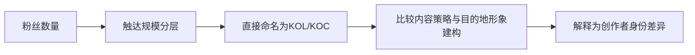
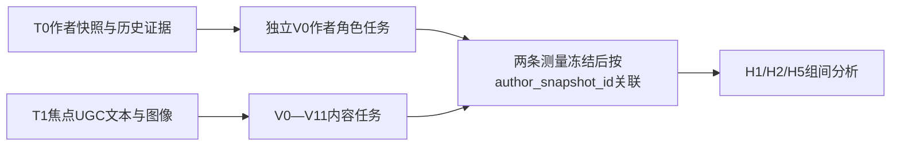

# KOL/KOC分类必要性、双人编码信度与自动化实施评估

> **文档状态**：`SUPERSEDED / HISTORICAL`
> **现行上位标准**：[`编码表.md`](../data-dictionary/编码表.md) v3.13.0
> **替代决定**：[`2026-08-24 KOL/KOC型试编码立即启动决策`](./2026-08-24-KOL-KOC型试编码立即启动决策.md)。本文用于追溯早期必要性与工作量评估；当前CI固定`UNAVAILABLE`，角色使用`KOL_TYPE/KOC_TYPE/HYBRID/ORDINARY/UNK/NA`。

## Material Passport

- Origin Skill: academic-research-suite / experiment-agent
- Origin Mode: plan
- Origin Date: 2026-08-21
- Verification Status: `DESIGN REVIEWED / EMPIRICALLY UNVERIFIED`
- Version Label: `kol_koc_measurement_report_v1.3`
- Latest Revision Date: 2026-08-22
- 目标读者：研究负责人、人工编码员、数据与模型工程伙伴
- 直接影响范围：V0创作者画像、作者数据快照、作者级人工金标、作者角色模型、H1/H2/H5及相关分组分析
- 原则上不受影响范围：V0—V11的定义、切分单位、值域、证据跨度和原定内容信度流程

---

## 一、执行结论

### 1.1 是否有必要分类KOL与KOC

结论需要分成两个层次：

1. **创作者分组是当前研究的必要变量。** 论文题目、RQ1、RQ2以及当前主检验H1、H2、H5都要求比较KOL与KOC。如果没有可复核的创作者分组，这些研究问题无法成立。
2. **语义上的KOL/KOC角色分类并不是所有旅游UGC研究都必须具备。** 如果团队愿意把题目和研究问题改成“不同触达规模创作者的内容差异”，则只需粉丝规模分层，不必增加主观角色编码。

因此，本项目真正需要作出的选择不是“要不要多加一列”，而是：

- 保留KOL/KOC作为核心理论身份，就必须增加独立、可验证的`creator_role`；或者
- 放弃KOL/KOC身份主张，把研究明确改写为不同`reach_tier`之间的比较。

### 1.2 推荐决定

**推荐保留当前KOL/KOC研究方向，但采用“触达规模 + 创作者角色”双轴试点；在试点通过之前，不立即修改现行编码表。**

推荐理由：

- 现行“粉丝不足1万 = KOC”容易把普通用户、低粉丝职业创作者和消费者型创作者混为一类；粉丝数更适合作为规模指标，而不是角色本身。
- KOL/KOC是当前论文的核心解释变量，完全删除将连带改写题目、理论、RQ、H1/H2/H5和结果章节。
- 当前编码表仍为`CALIBRATION_READY / NOT_FROZEN`，尚未形成正式盲试信度结果。现在先做作者角色试点，比正式编码后再改动成本更低。
- 作者角色可以独立于V0—V11编码，每个“平台账号 × 观察期”只判断一次，不必在每篇、每段或每张图片上重复判断。

### 1.3 对两人团队的总体判断

Krippendorff's alpha可用于两名或更多编码员，Cohen's kappa则是两名编码员名义变量一致性的经典指标。[Hayes与Krippendorff（2007）](https://doi.org/10.1080/19312450709336664)；[Cohen（1960）](https://doi.org/10.1177/001316446002000104) 据此，本项目作出一项**实施层判断**：两名编码员可以完成共同校准、独立标注、裁决前信度计算和双人共识，人数本身不是阻塞项。

两人方案的限制必须透明：团队不能声称存在独立第三方仲裁，共同训练造成的共享偏差也不会被人际信度自动发现。两人无法达成共识时，`adjudication_status`应保留为`UNRESOLVED`且`creator_role`为空或`UNK`，不能强制二分；这与“客观材料不足”必须分开记录。

### 1.4 只用粉丝量对研究逻辑链的影响

只用粉丝量并非统计上不可用，但它实际测量的是**触达规模**。若在论文中直接把该变量命名为KOL/KOC身份，逻辑链会发生构念错位：

该链条的最后一步超出了粉丝量能够单独支持的解释范围。低粉丝的专业创作者、高粉丝的消费者型创作者和低粉丝普通用户都可能被错置；同一自然人在不同平台也可能因粉丝规模不同而获得不同“身份”。因此，即使H1/H2/H5出现显著差异，也无法排除差异来自规模、平台、账号成熟度或商业化程度，而非角色本身。

对应的研究边界应明确为：

- 如果只使用粉丝量，题目、RQ、假设和结论必须改写为“不同触达规模创作者的差异”；
- 如果保留“KOL与KOC视角”，则必须把`creator_role`作为独立构念，并把`reach_tier`作为协变量或敏感性分析；
- 模型准确复制粉丝阈值只能证明规则可重复，不能修复上述构念错位。

---

## 二、三个候选方案比较

| 方案 | 核心做法 | 构念效度 | 人工负担 | 对当前论文影响 | 判断 |
|---|---|---:|---:|---:|---|
| A. 继续沿用现规则 | 仅以绝对粉丝阈值生成H-KOL/W-KOL/T-KOL/KOC | 较弱：规模与角色混合 | 最低 | 最小 | 不推荐作为KOL/KOC身份主分析 |
| B. 双轴方案 | `reach_tier`客观派生；`creator_role`独立人工编码并训练模型 | 最强，但需试点验证 | 中等、作者级一次性 | V0、分析和论文需同步 | **推荐** |
| C. 仅研究触达规模 | 使用中性规模档，不再声称KOL/KOC角色差异 | 清晰 | 低 | 题目、理论、RQ和H需实质改写 | 试点失败时的正式回退方案 |

方案A可能获得近乎完全一致的“编码结果”，因为阈值可由程序直接计算；但这只能说明**规则可重复**，不能证明“小于1万粉丝就是KOC”。高信度不能弥补构念定义不充分。内容分析中的信度与效度必须分开讨论。[Lombard、Snyder-Duch与Bracken（2002）](https://doi.org/10.1111/j.1468-2958.2002.tb00826.x)

---

## 三、推荐的最小双轴测量

### 3.1 触达规模：确定性字段

`reach_tier`只由带采集时点的原始粉丝数派生，不需要人工判断或人工置信度。为避免继续暗示角色，建议采用中性代码：

| 建议代码 | 粉丝数 | 说明 |
|---|---:|---|
| `R4_MEGA` | ≥100万 | 超大触达规模 |
| `R3_MACRO` | 10万—不足100万 | 大触达规模 |
| `R2_MICRO` | 1万—不足10万 | 中小触达规模 |
| `R1_NANO` | 不足1万 | 小触达规模，不自动等于KOC |
| `R0_UNKNOWN` | 缺失或不可审计 | 不得自动归入最低档或KOC |

Lee等（2024）直接采用了mega/macro/micro/nano等影响者规模层级，[可作为“规模分层”与“角色判断”分开的相邻依据](https://doi.org/10.1177/20563051241269269)，但该研究并未验证本项目阈值在所有平台都通用。因此，现有阈值可先为保持历史连续性而沿用，但只能称为本项目的操作性规模档，并应通过连续`log1p(follower_count)`和平台内**样本内**分位数作敏感性分析。

### 3.2 创作者角色：作者级主观测量

`creator_role`以“平台账号 × 观察期”为单位，建议保留以下值：

| 角色 | 最低操作含义 |
|---|---|
| `KOL` | 具有专业、职业、认证或领域权威证据，并存在持续的领域创作与影响证据 |
| `KOC` | 以消费者或旅行者身份持续分享第一手经验，并存在非偶发的社群影响证据 |
| `ORDINARY` | 普通用户或偶发分享者，不满足持续创作/影响条件 |
| `HYBRID` | 专业权威与消费者经验两类角色证据同时显著 |

Yi与Xian（2025）表明KOC角色由创作者、营销者、品牌和平台共同生产，并讨论了日常化人设与平台劳动。[该研究](https://doi.org/10.1145/3711086)支持KOC不是一个纯粹粉丝数变量；把“消费者第一手经验”设为本项目的操作性证据，则是仍需试点检验的**项目构念决定**，不是该文献直接给出的必要条件。

角色值以外的三类状态必须拆开，不能都塞进`INSUFFICIENT`：

| 状态字段 | 建议值 | 含义 |
|---|---|---|
| `evidence_status` | `SUFFICIENT / INSUFFICIENT` | 冻结证据窗口内的材料是否客观足以判断 |
| `adjudication_status` | `PENDING / RESOLVED / UNRESOLVED` | 两名编码员是否已形成可用裁决 |
| `prediction_status` | `PREDICTED / ABSTAIN / REVIEW` | 模型是否给出可接受预测；拒判原因另存`abstain_reason` |

`creator_role`只保存实质角色，无法确定时为空或`UNK`。证据不足不等于两人意见不一致，模型低置信或分布外也不等于作者属于某种角色。

若试点通过，H1/H2/H5的主比较纳入**按冻结规则完成裁决且证据充分**的`KOL`与`KOC`；人工置信度只触发复核，不用于事后筛选样本。`reach_tier`或连续粉丝数作为独立协变量和敏感性分析，`ORDINARY/HYBRID`透明报告并排除出主二分，证据不足或未决样本则按状态单独报告。若两类角色在触达规模上完全没有共同支持，研究只能解释现实中的“角色—规模组合差异”，不能声称识别了脱离规模的纯角色效应。

### 3.3 先编码证据，再形成角色

为了让两名编码员和后续模型判断同一组可观察事实，建议先建立少量独立证据字段，而不是直接凭整体印象二选一：

| 中文标签 | 建议字段 | 类型 |
|---|---|---|
| 个人创作者证据 | `ev_individual_creator` | 0/1/UNK |
| 专业或权威证据 | `ev_expert_authority` | 0/1/UNK |
| 消费者第一手经验 | `ev_consumer_experience` | 0/1/UNK |
| 持续领域创作 | `ev_sustained_creation` | 0/1/UNK |
| 稳定社群影响 | `ev_community_influence` | 0/1/UNK |
| 角色证据充分 | `evidence_status` | SUFFICIENT/INSUFFICIENT |

每个主观证据字段均保存置信度和最短证据位置。本报告采用唯一金标方案：**两名编码员同时标证据字段和依据冻结编码簿作出的角色判断，裁决后的`adjudicated_role`是角色模型唯一的人类金标**；证据字段是可解释的辅助金标和规则一致性审计。确定性规则可以发现父子冲突，分类器可以学习预测角色，但二者都不得生成、覆盖或“修正”训练金标。商业化/职业化线索保持独立，不与V1“明确商业披露”混为一个身份总分。

---

## 四、对V0—V11既有设计与未来信度的影响

### 4.1 不改变的部分与仍须完成的工作

当前项目尚未形成可宣称“继续有效”的正式V0—V11独立盲试信度结果，视觉轨也尚未冻结。现有共同校准、编码表和模板产物仍是校准证据，**原定V0—V11独立盲试必须照常完成**。

新增V0作者角色本身不改变V0—V11的定义和未来信度流程。若以后已经形成正式结果，只有在下列条件均保持不变时，才可说这些结果不会因V0新增而自动失效：

- V0—V11的标签定义和值域不变；
- 文本片段和图片观察单位不变；
- 内容编码样本与独立盲标程序不变；
- `creator_role`、粉丝数、认证、作者名和模型建议不向内容编码员展示；
- 作者角色不作为V0—V11内容模型的预测输入。

因此，本次V0试点不要求改写或提前重做V0—V11的标签定义，但也不能免除其原定盲试。未来需要新增或重算的是按`reach_tier`和`creator_role`分别报告的描述统计、诊断性信度切片和H1/H2/H5估计。

当前编码表本身规定：实质修改只使“受影响字段”的旧信度失效，并须使用新样本确认；本次若只改V0，就不应连带宣布V0—V11全部失效。[编码表第八节](../data-dictionary/编码表.md#八标注方案与模型验证)

### 4.2 真正可能伤害信度与效度的路径

| 风险 | 可能后果 | 控制措施 |
|---|---|---|
| 角色光环/预期效应 | 两名编码员看到KOL身份后，都更容易把内容判为专业、知识型或商业化；表面一致率甚至可能上升，但效度下降 | 内容任务隐藏角色、粉丝、认证、简介和作者名 |
| 任务疲劳 | 在当前大表内新增大量作者字段，降低V0—V11判断质量 | 作者表和内容表分开、分时段执行，角色只编码一次 |
| 单帖反推身份 | 用待分析的V0—V11或焦点帖互动结果定义KOL/KOC，形成循环定义 | 角色任务只使用T0作者证据包，不显示T1内容结果 |
| 重复单位 | 同一作者在多篇帖子中重复编码，使样本数和信度被虚增 | 信度单位固定为`author_snapshot_id` |
| 低频类别 | 总体alpha看似合格，但KOL或KOC阳性样本很少 | 同时报各类支持数、逐类一致率和置信区间 |

### 4.3 推荐的任务信息隔离与可行元数据遮蔽

- V0任务看不到T1焦点帖的人工/模型内容标签、互动结果和研究假设方向。
- V0—V11任务看不到作者角色、粉丝数、认证、简介和作者模型建议。
- 两项任务可以由同两名编码员承担，但应使用匿名ID、不同任务批次和独立manifest。
- 正文自称、图片水印或既有记忆仍可能让编码员识别作者，因此本项目不能承诺完全“双盲”。一旦识别或怀疑识别，应记录`blindness_breach`及原因，并在正式结果中对这些单位进行敏感性审计。

---

## 五、两名编码员的最低可行工作流

### 5.1 共同校准

- 先冻结统一作者证据包：简介、认证/职业线索、粉丝原值和采集时间、T1之前的固定历史窗口、证据缺失原因。
- 使用边界丰富的作者样本共同讨论`KOL↔HYBRID`、`KOC↔ORDINARY`、个人↔机构、账号转型和资料不足。
- 共同校准样本只用于修订规则，不计算正式信度，也不进入锁定测试。
- 校准量以覆盖全部主要规则边界为准；现有帖子级预算不能机械移植成作者级五分类样本量。

### 5.2 独立盲试标

- 更换从未共同讨论的新作者快照，两人独立编码；本轮结束前不交换标签、理由或置信度。
- 只有先冻结完整、合格且可审计的作者抽样框，并保存每个单位的纳入概率，才能把其中的随机样本称为“概率样本”并用于总体推断；否则只能称为“从当前可审计作者框随机抽取的试点样本”。
- 边界挑战样本用于检验规则，不用于估计总体信度或证据不足率；两类样本的manifest和结果必须分开。
- 数据盘点后、查看正式盲标结果之前，预注册各角色最低支持数、置信区间精度和H1/H2/H5功效门。当前候选作者总数不能替代这些条件。

### 5.3 信度计算

所有指标必须使用裁决前锁定的两份原始盲标：

1. 每个二元证据字段和`evidence_status`分别计算名义尺度Krippendorff's alpha及聚类bootstrap 95%置信区间；
2. 将裁决前的`raw_role_response`按`KOL/KOC/ORDINARY/HYBRID/NO_ROLE_DECISION`计算过程级名义alpha；`NO_ROLE_DECISION`只是编码反应，不是`creator_role`类别；
3. 另报告双方都认为证据充分时的四类角色条件一致率，但不能只报这一结果而掩盖材料不足；
4. Cohen's kappa作为两人条件下的敏感性结果；类别高度不平衡时可补充Gwet AC1作诊断，但alpha仍是本项目预定主门，且不得把kappa的解释区间套用于AC1。[Gwet（2008）](https://doi.org/10.1348/000711006X126600)；[Vach与Gerke（2023）](https://doi.org/10.1016/j.mex.2023.102212)
5. 同时报原始一致率、过程级五响应混淆矩阵、逐类one-vs-rest阳性/阴性一致率、各角色支持数、低置信率、证据不足率和元数据遮蔽失效数。

Marchal等（2022）说明多标签标注的一致性评估并不简单，[不能被单一汇总数充分概括](https://aclanthology.org/2022.coling-1.322/)。据此，本项目选择逐证据字段报告alpha，并把集合级结果仅作补充；“逐列为主”是本报告的工程与分析设计，而不是该论文直接规定的唯一方法。

### 5.4 裁决与扩展

- 先计算信度并锁定原始记录，再由两人讨论形成独立的`adjudicated_role`；不得覆盖原始盲标。
- 若冻结窗口内材料客观不足，保存`evidence_status=INSUFFICIENT`且角色为空；若材料充分但两人仍无法共识，保存`adjudication_status=UNRESOLVED`且角色为空或`UNK`。两种情况均不得伪造成实质角色金标。
- 若分歧暴露出定义、时间窗、值域或纳入规则问题，属于实质修订：V0升版，并使用全新样本重新确认；不在同一批作者上反复修改到高信度。
- 锁定评估集全部双标。其他训练作者可由一人主标，第二人复核全部低置信、冲突、稀有、时间异常样本及预注册随机比例；两人轮换主标批次。

### 5.5 人工信度门

沿用现行项目门槛：

- 核心V0字段`alpha >= 0.80`、类别支持可解释、置信区间不过宽且无持续系统性边界分歧，才可冻结并进入模型训练；
- `0.667 <= alpha < 0.80`只能暂定或探索使用；
- `alpha < 0.667`不得训练正式角色模型，应先修订或放弃该字段；
- 即使总体alpha通过，KOL/KOC阳性一致率或样本量不足也不能启动主比较。

上述alpha点估计门沿用现行项目规则；“置信区间不过宽”、最低逐类支持数、可接受证据覆盖率和分析功效的具体数值，必须在数据盘点后、查看正式盲标结果前预注册，不能事后按结果解释。

---

## 六、不依赖神经网络成功的可行方案

### 6.1 依据当前流程的可行性判断

| 工作项 | 当前可行性 | 条件或限制 |
|---|---|---|
| 粉丝数生成`reach_tier` | **可行** | 必须取得带采集时点、来源和解析状态的粉丝数；缺失不得归入最低档 |
| 两名编码员开展`creator_role`试点 | **可行** | 每个“平台账号 × 观察期”只编码一次，与V0—V11内容任务分离 |
| 计算双人角色信度 | **可行** | 使用裁决前记录；两人可形成共识，但没有独立第三方仲裁 |
| 当前模型直接识别作者身份 | **不可直接执行** | 现有模型和schema均为帖子级旅游相关性任务，且正式作者证据与角色金标尚不存在 |
| 后续训练独立作者角色模型 | **有条件可行** | 依赖G0—G3、作者级金标、账号/时间/平台隔离评估和拒判机制 |
| 继续V0—V11内容编码与模型准备 | **可并行推进** | 作者身份、粉丝数和作者模型建议不得暴露给内容编码员或进入内容模型输入 |

因此，项目不应把“神经网络能否稳定判断身份”设为V0—V11内容主轨或角色构念能否成立的前置条件。作者角色先由人类定义和验证，模型只负责在通过质量门后学习与扩展。

### 6.2 推荐的系统管线

“模型训练完成后全部由系统输出”可以作为G4通过后的工程目标，但在取得作者证据、金标和锁定测试结果前，不能把它写成既定可实现事实。即使最终自动化，也不等于每一列都由同一个神经网络猜测。推荐管线为：

1. **确定性层**：`follower_count`按版本化规则生成`reach_tier`；
2. **证据模型**：从T0简介和历史材料预测各证据字段及其概率、证据位置；
3. **角色层**：以人类`adjudicated_role`为唯一角色金标，比较冻结规则基线与校准分类器，预测`KOL/KOC/ORDINARY/HYBRID`；规则或模型不得反向生成训练金标；
4. **拒判层**：资料缺失、证据冲突、低置信、时间越界或分布外平台只改变`evidence_status`或`prediction_status=ABSTAIN/REVIEW`，预测角色留空并记录`abstain_reason`，不得输出伪角色`INSUFFICIENT`；
5. **评估层**：分别实施账号分组的同期测试、较晚快照的前向时间测试和leave-one-platform-out挑战测试，报告逐类Precision、Recall、F1、校准、coverage–risk及H1/H2/H5对误分类的敏感性。

模型开发不应从端到端神经网络开始。第一轮至少比较冻结规则、TF-IDF加多类Logistic Regression、结构化证据加轻量分类器和预训练中文编码器；粉丝数不得作为角色模型主规格的捷径特征，并应进行“有/无粉丝数”消融。神经网络只有在锁定测试上真正优于简单基线时才有采用理由。

### 6.3 自动化失败不等于研究失败

如果G0—G3通过而G4失败，角色构念和人工金标仍然成立，可采用以下人工主导路径：

- 锁定信度样本和模型测试集由两人全部独立标注并裁决；
- 规则冻结后，其余作者由两人分工单标，另一人复核全部低置信、证据冲突、稀有类别、时间异常单位及预注册随机审计样本；
- 正式分析使用人类裁决角色，模型只做证据检索或优先级排序，不发布自动角色结果。

如果G1—G3本身失败，即作者资料覆盖不足、角色信度不足或KOL/KOC组别样本不足，则不能用模型弥补构念和数据缺口。此时应正式回退到`reach_tier`主分析，并同步将题目、RQ、假设和结论改写为触达规模差异。

Pew Research Center的相邻实践以722个人工编码账号作为验证集，提示GPT-4.1 mini根据简介和近期帖子进行二元影响者判断，并观察到平台间误差差异；它证明这类输入可用于规模化辅助判断，但不是本项目多类角色模型、训练方案或拒判机制的直接验证。[Pew方法报告（2026）](https://www.pewresearch.org/data-labs/2026/05/07/wellness-influencers-methodology/) 拒判设计的独立方法依据来自选择性分类：模型可用较低覆盖率换取较低的已接受样本风险。[SelectiveNet](https://proceedings.mlr.press/v97/geifman19a.html)

项目文档中约1,168位作者目前只是尚未由冻结manifest复核的候选数量上限，不能据此判断试点或锁定测试已经充分。在作者资料可得率和KOL/KOC实际人数未知前，不能承诺复杂神经网络一定优于轻量模型，也不能预先承诺自动覆盖率。

---

## 七、工程影响与最小数据契约

### 7.1 当前缺口

评估时的清洗输入只要求帖子作者平台ID，派生schema仅保存作者哈希/存在性，没有作者画像快照、粉丝采集时点、证据来源或作者级金标。[历史 snapshot.py](https://github.com/ottercoconut/tourism-ugc-study/blob/2b30eb1520b4683dbfda91770d6abd25f6f6af3e/src/tourism_ugc_study/cleaning/snapshot.py#L27)；[历史 schema.py](https://github.com/ottercoconut/tourism-ugc-study/blob/2b30eb1520b4683dbfda91770d6abd25f6f6af3e/src/tourism_ugc_study/cleaning/schema.py#L280)

评估时的旅游相关性模型和预测表以帖子为主键并硬编码二分类语义，不能通过替换标签直接变成作者角色模型。[历史 relevance.py](https://github.com/ottercoconut/tourism-ugc-study/blob/2b30eb1520b4683dbfda91770d6abd25f6f6af3e/src/tourism_ugc_study/models/text/relevance.py#L28)；[历史 schema.py](https://github.com/ottercoconut/tourism-ugc-study/blob/2b30eb1520b4683dbfda91770d6abd25f6f6af3e/src/tourism_ugc_study/cleaning/schema.py#L704)

评估时的人工标注基础设施也不能直接承载双人作者盲标：校准模块只接受`POST/TEXT_SEGMENT/IMAGE`三种单位，[calibration.py](../../src/tourism_ugc_study/annotation/calibration.py#L78)；当时的帖子标注唯一约束不含编码员维度，[历史 schema.py](https://github.com/ottercoconut/tourism-ugc-study/blob/2b30eb1520b4683dbfda91770d6abd25f6f6af3e/src/tourism_ugc_study/cleaning/schema.py#L877)；仓库内也没有可直接复用的作者角色agreement实现。因此必须新增作者任务导出/导入、每名编码员独立行、冻结、裁决前一致性计算和裁决能力，不能只给当前帖子表换列名。

### 7.2 建议新增的独立对象

| 对象 | 用途 | 最低核心字段或约束 |
|---|---|---|
| `author_profile_snapshots` | 保存可重建的只读作者证据快照 | `author_snapshot_id`主键、`source_snapshot_id`谱系、`platform_key`、匿名平台账号ID、`profile_captured_at`、`evidence_window_start/end`、`evidence_manifest_sha256`、`evidence_extraction_version`、`follower_count_raw_text`、`follower_count_normalized`、`follower_count_parse_status/version`、`source_locator`、`missing_reason` |
| `post_author_snapshot_links` | 指明每个帖子版本使用哪次作者快照 | 复合键至少含`source_post_id`、`source_version`、`author_snapshot_id`；另存帖子—快照时间差和匹配状态 |
| `creator_entity_links` | 私有保存有证据的跨平台真人关联 | `creator_entity_id`、平台账号、匹配证据、匹配状态和版本；同名不得自动合并 |
| `author_role_annotations` | 保存两名编码员裁决前原始盲标 | 唯一键至少含`task_run_id`、`author_snapshot_id`、`annotator_hash`、`guide_version`；另存证据字段、`evidence_status`、`raw_role_response`、逐字段置信度、证据位置和`blindness_breach` |
| `author_role_adjudications` | 保存裁决而不覆盖原始记录 | `author_snapshot_id`、`adjudicated_role`、`evidence_status`、`adjudication_status`、裁决理由、规则版本；未决或证据不足时角色为空 |
| `author_role_model_*` | 独立保存作者模型运行、切分、预测与评估 | 模型、gold、split、config、各类概率、阈值、`prediction_status`、`abstain_reason`和manifest |

作者画像属于私有研究层。不得削弱现有公开发布包对作者画像和敏感字段的排除；公开结果只发布必要的去标识字段、聚合计数和缺失率。

### 7.3 与现有内容编码表的接口

- 作者角色单设作者级工作表/文件，一行对应一个`author_snapshot_id`。
- V0—V11内容工作表在人工编码期间隐藏作者角色与粉丝信息。
- 两条测量冻结后，系统可只读关联`author_snapshot_id`、`reach_tier`和`creator_role_adjudicated`；不得让内容编码员逐帖重复填写。
- V0—V11内容模型不得使用`reach_tier`或`creator_role`作输入；二者只用于抽样平衡、子群模型审计和下游分析。

### 7.4 切分和跨平台身份规则

- 主同期测试按平台账号分组，同一账号的全部快照和T0历史材料不得跨训练/开发/测试集。
- 若私有证据能高置信关联同一真人的跨平台账号，则这些账号以同一`creator_entity_id`整体分组；未确认者不得靠昵称或头像猜测合并，并须披露残余跨平台泄漏风险。
- 前向时间测试使用较早窗口训练、较晚作者快照测试，用于评估时间漂移；它不能被普通账号分组测试替代。
- leave-one-platform-out是未见平台的挑战测试。未通过的平台不得自动发布角色预测，只能`ABSTAIN/REVIEW`。

---

## 八、决策门与回退规则

| 决策门 | 通过条件 | 失败后的回退 |
|---|---|---|
| G0 研究定位门 | 团队确认继续主张KOL/KOC角色差异 | 改为仅比较触达规模，并同步改题目/RQ/H |
| G1 数据门 | 能形成带时点、来源可审计且达到预注册覆盖率的作者证据包 | 仅保留`reach_tier`；最新粉丝数只能标为回溯代理 |
| G2 人工门 | `evidence_status`和过程级角色判断通过双人信度门，无持续规则性分歧 | 修订后换新样本；仍失败则放弃角色主分析 |
| G3 样本门 | 在证据充分且裁决完成的样本中，KOL与KOC均有预注册要求的作者和帖子数支撑H1/H2/H5，且角色间存在可解释的规模共同支持 | KOL/KOC降为探索；主分析改为规模档或总体内容轮廓 |
| G4 模型门 | 锁定测试集逐类指标、校准、平台/时间子群和下游估计均通过预注册门 | 保留人工角色金标；模型仅作辅助或不发布 |

如果采用模型试运行门，可把KOL/KOC逐类Precision与Recall点估计均不低于0.85、95%置信下限不低于0.75作为待预注册的保守起点；这不是外部通用标准，且必须在打开锁定测试集之前冻结。最终更重要的门是模型误分类敏感性分析不会改变H1/H2/H5的方向和实质解释。

门的顺序不得倒置：G0—G3通过后，团队才升编码表版本并冻结角色构念；随后建立正式金标、训练并评估模型。G4只决定**自动化输出能否进入正式分析**，不决定一个已经通过人工试点的构念能否写入编码规范。

---

## 九、推荐实施顺序

1. **共同确认研究定位**：选择双轴KOL/KOC方案或仅触达规模方案。
2. **不改编码表先做数据盘点**：只读检查正式源库是否具备粉丝数、简介、认证和历史材料，并形成缺失率报告。
3. **建立独立试点契约**：生成作者证据包和作者角色试编码模板，不改变V0—V11，也不把试点标签用于正式分析。
4. **完成双人共同校准和独立盲试标**：在可行元数据遮蔽下执行，并根据预注册支持数、置信区间和分歧结构决定是否继续。
5. **G0—G3通过后再升编码表内部版本**：建议把V0.1拆成`V0.1a Reach tier`与`V0.1b Creator role`，保留V0.2内容垂直度；同步更新编码簿、论文、schema契约和分析计划。
6. **并行推进内容主轨**：V3—V6共同校准可以与作者数据盘点并行；KOL/KOC问题不应阻塞内容标签的校准与模型准备。
7. **作者金标充分后才训练模型**：先比较规则/轻量基线、预训练中文编码器和结构化LLM抽取，不预设复杂神经网络最好。
8. **冻结后关联分析**：只有V0人类角色测量和V3—V6内容测量通过各自质量门，才启动H1/H2/H5正式比较；凡正式分析使用模型扩展结果，相应模型还必须单独通过G4。

### 当前阻塞边界

- **不阻塞**：V3—V6文本内容编码的共同校准、片段切分实现、现有内容模型工程准备。
- **阻塞**：把任何账号正式称为KOL/KOC、按KOL/KOC训练作者模型、检验H1/H2/H5、撰写相关实证结论。

---

## 十、需要工程伙伴确认的事项

- [ ] 是否接受`reach_tier`与`creator_role`完全分离；
- [ ] 是否接受新增私有`author_profile_snapshots`及帖子映射，而不是把作者信息重复塞入帖子表；
- [ ] 是否能从正式只读源或合规回补流程取得带时点的粉丝数、简介与历史证据；
- [ ] 是否接受作者角色与现有旅游相关性/内容模型建立独立schema、运行记录和测试集；
- [ ] 是否接受把证据不足、人工未决和模型拒判分别保存为`evidence_status`、`adjudication_status`和`prediction_status`，而不是强制全部账号二分；
- [ ] 是否接受新增作者任务的双人独立行、冻结、裁决前agreement和裁决模块，而不是复用现有帖子标注唯一键；
- [ ] 是否接受有证据的跨平台账号私有映射，并分别实施账号分组、前向时间和留一平台评估；
- [ ] 是否同意在试点通过前维持编码表v3.11.0的V0构念不变，并把本报告保持为`PROPOSAL`。

## 十一、建议批准语句

> 项目暂不把“粉丝不足1万”直接解释为KOC。团队先以独立作者快照开展`reach_tier + creator_role`双轴可行性试点；试点不改变V0—V11内容标签及其原定信度流程。两名编码员采用任务信息隔离与可行元数据遮蔽、共同校准、独立标注和裁决前信度计算。G0—G3通过后，团队升编码表版本、冻结构念并建立正式角色金标；只有G4再通过，模型自动输出才可用于H1/H2/H5正式分析。

---

## 参考依据

### 项目内依据

1. [`编码表.md`](../data-dictionary/编码表.md)：现行V0、双人信度门、实质修订与受影响字段重编码规则。
2. [`生产端定位、KOL-KOC识别与受众端研究设计报告.md`](./2026-08-10-生产端定位、KOL-KOC识别与受众端研究设计报告.md)：历史候选的角色构念、T0/T1边界和作者快照需求。
3. [`编码表与AI协同后续执行清单.md`](../planning/编码表与AI协同后续执行清单.md)：共同校准、独立盲试标、人工金标、模型验证和版本门。
4. [`论文草稿.md`](../../manuscript/论文草稿.md)：当前题目、RQ1/RQ2、H1/H2/H5和创作者分层表述。

### 外部方法依据

1. [Hayes, A. F., & Krippendorff, K. (2007). *Answering the Call for a Standard Reliability Measure for Coding Data*.](https://doi.org/10.1080/19312450709336664)
2. [Cohen, J. (1960). *A Coefficient of Agreement for Nominal Scales*.](https://doi.org/10.1177/001316446002000104)
3. [Lombard, M., Snyder-Duch, J., & Bracken, C. C. (2002). *Content Analysis in Mass Communication: Assessment and Reporting of Intercoder Reliability*.](https://doi.org/10.1111/j.1468-2958.2002.tb00826.x)
4. [Lee, J., Walter, N., Hayes, J. L., & Golan, G. J. (2024). *Do Influencers Influence? A Meta-Analytic Comparison of Celebrities and Social Media Influencers Effects*.](https://doi.org/10.1177/20563051241269269)
5. [Yi, H., & Xian, L. (2025). *The Informal Labor in Creator Economy: The Making of Key Opinion Consumers From Ordinary Users on Xiaohongshu*.](https://doi.org/10.1145/3711086)
6. [Marchal, M., et al. (2022). *Establishing Annotation Quality in Multi-label Annotations*.](https://aclanthology.org/2022.coling-1.322/)
7. [Gwet, K. L. (2008). *Computing inter-rater reliability and its variance in the presence of high agreement*.](https://doi.org/10.1348/000711006X126600)
8. [Vach, W., & Gerke, O. (2023). *Gwet's AC1 is not a substitute for Cohen's kappa*.](https://doi.org/10.1016/j.mex.2023.102212)
9. [Geifman, Y., & El-Yaniv, R. (2019). *SelectiveNet: A Deep Neural Network with an Integrated Reject Option*.](https://proceedings.mlr.press/v97/geifman19a.html)
10. [Pew Research Center (2026). *Moms, Coaches, Doctors, Entrepreneurs: Who Are America's Health and Wellness Influencers?—Methodology*.](https://www.pewresearch.org/data-labs/2026/05/07/wellness-influencers-methodology/)
