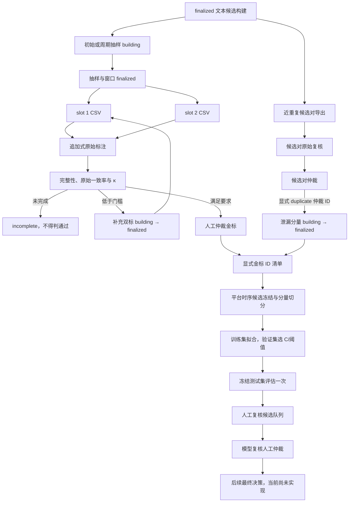
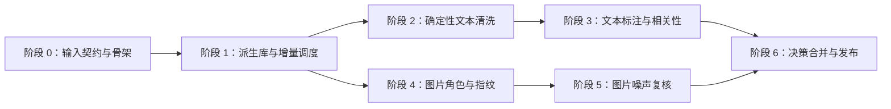

# tourism-ugc-study 数据清洗工程方案

> 方案版本：`2.4`
> 同步日期：`2026-07-31`
> 配套科研文档：[data-cleaning-research.html](../methods/data-cleaning-research.html)
> 配套标注手册：[文本数据清洗人工标注方法](文本数据清洗人工标注方法.md)

## 1. 文档职责

本文只回答“如何实现、运行、验证和回滚”。研究对象边界、标签定义、抽样理由、人工一致性、论文表述和学术引用以配套科研文档为准。

本方案同时记录已实现基础设施和后续工程规格。当前已具备派生库、增量调度、确定性文本规范化、重复候选、文本抽样/追加式标注、人工确认近重复的泄漏分组、离线相关性基线与复核候选，以及图片角色、本地 manifest、只读文件指纹和重复候选框架；`scripts/build_research_dataset.py` 仍只覆盖既有字段规范化和部分派生逻辑，不属于新版清洗流水线。正式人工标签与正式模型运行尚未发生，真实图片尚未落盘验收，图片人工噪声决策和运行级最终决策表仍待实现。

> **正式标注阻塞项：**清洗专用人工方法只要求结构可用性、旅游相关性和近重复关系。当前 schema v10、CSV 导入器和一致性程序仍强制采集并验收商业属性，且没有为结构无效文本提供旅游相关性“不适用”状态。两者是已实现接口与清洗方法之间的差异；正式人工标注开始前必须按配套手册第 16 节修正并补测，不能把旧接口字段解释为新的清洗任务。

当前实施状态集中如下，避免把目标接口误认为现有能力：

| 能力 | 状态 | 说明 |
| --- | --- | --- |
| 正式采集库与只读审计 | 已具备 | 可查询 `web_posts`、`web_post_images`；不得回写 |
| 既有派生构建脚本 | 部分具备 | 只覆盖部分规范化和派生字段，不等同于本方案 |
| 派生清洗库与增量调度 | 已实现 | 已支持只读快照、分轴增量发现、冻结批次、检查点、状态查询和显式恢复 |
| 文本规范化、重复与相关性 | 工程接口已实现 | 规范化、候选对、两层人工确认、抽样、双标/仲裁、泄漏安全切分、线性基线和复核候选均可追溯；正式人工与正式训练尚未执行 |
| 图片角色、本地 manifest、文件指纹与重复候选 | 框架已实现、真实输入阻塞 | 合成夹具已覆盖角色、路径边界、解码、SHA/pHash、候选、无网络和显式恢复；正式文件仍需上游提供受控本地 manifest |
| 图片人工噪声决策 | 待实现 | 当前信号、精确簇和近似对均不是最终图片标签 |
| 最终分析视图与质量报告 | 待实现 | 必须建立在前述阶段的版本化结果之上 |

## 2. 两份文档的同步契约

以下字段在工程文档与科研文档中必须保持一致，并在同一个 commit/PR 中更新：

| 同步项 | 当前值 |
| --- | --- |
| 清洗方案版本 | `2.4` |
| 文本标签手册 | 当前实现为 `text-relevance-v1.0`；清洗专用目标为 `text-cleaning-v1.0`，落实前属于正式标注阻塞项 |
| 图片标签手册 | `image-noise-v1.0` |
| 随机种子 | `20260728` |
| 输入前提 | 上游交付的数据集已只含青岛；清洗仅验证前提，不筛选城市、不生成范围标签 |
| 当前数据库状态 | 上游 schema 已移除城市字段并以迁移 13 证明青岛范围定稿；最终记录数由每次快照动态统计 |
| 当前图片关系 | 数量由每次快照按 `content`、`author_avatar`、`page` 动态统计，不写死阶段值 |
| 文本初始人工量 | 500 条概率样本＋200 条定向样本；200 条双标 |
| 图片初始人工量 | 600 张概率样本＋规则/重复簇代表项；200 张双标 |
| 文本分类器 | 字符 2–5 gram TF-IDF＋`LinearSVC` |
| 图片近同方法 | 文件 SHA-256＋64 位 DCT pHash＋人工簇审阅 |
| 决策状态 | `keep`、`review`、`exclude`、`evidence_only` |
| 原始数据策略 | 源 SQLite 只读；不物理删除 |

同步规则：

1. 研究口径改变时，先修改科研文档，再在同一提交更新工程配置、schema 和验收条件。
2. 实现约束导致方法变化时，必须回到科研文档说明影响，不能只改代码。
3. 只修改文字说明、且不影响上表项目时，可单独更新对应文档。
4. 两份文档的版本号不一致时，不得执行正式清洗运行。

## 3. 权威输入与禁止项

### 3.1 权威输入

- 项目：`/Users/kawauso/Documents/Projects/TripPostCollect`
- 正式库：`/Users/kawauso/Documents/Projects/TripPostCollect/data/trippostcollect.sqlite`
- 帖子表：`web_posts`
- 图片关系表：`web_post_images`
- 图片主键：`web_post_images.id`
- 帖子主键：`web_posts.id`

### 3.2 禁止项

- 不使用 `data/trip_posts.sqlite3`、`data/trip_posts.db` 或 `data/trippostcollect.db` 等 0 字节文件。
- 不回写正式库，不物理删除源帖子或图片关系。
- 不在清洗运行中抓取、登录或重新访问平台。
- 不把原始 UGC、作者直接标识和图片字节提交到 Git。
- 不调用 LLM、云端分类 API、深度视觉模型或多模态模型。

### 3.3 当前数据库审视与实现影响

下表记录当前上游 schema 的稳定契约。帖子、平台和图片数量随采集继续增长，正式运行必须从冻结快照重新生成，不得把阶段数字硬编码进规则。

| 只读观察 | 当前结果 | 工程处理 |
| --- | --- | --- |
| 城市范围 schema | `web_posts` 不含 `city_name`；`schema_migrations` 的 13 / `remove_city_name` 表明上游已删除范围外记录后移除城市列 | 清洗读取该迁移作为上游范围声明；若旧版夹具仍含 `city_name`，只做整库断言，不生成逐条标签 |
| 输入数量 | 帖子、平台、检索词、时间和图片数量均未冻结 | manifest 从当前快照动态统计；最终数据量是容量规划中的唯一变量 |
| 平台字段形态 | 标题等字段允许存在平台结构差异 | 可用性规则必须分平台；无标题但正文有效不触发 `invalid` |
| 图片关系角色 | `web_post_images.image_role` 固定为 `content`、`author_avatar`、`page` | 头像离开内容图视图，页面图只作证据；各角色数量由快照报告 |
| 图片文件信息 | 文件级处理依赖上游另行提供的受控本地 manifest | manifest 不可用时图片文件阶段标记为 `blocked_by_manifest`，不能伪造结果或在线补抓 |
| URL 与文本重复候选 | 重复规模必须从正式快照重新计算 | URL 复用和文本相同只生成簇；源关系不删除，近重复另行评估 |

此前 LLM 对少量标题、正文和图片关系做过探索性浏览，提示关键词召回中可能混入非旅游主旨内容，且图片关系可能包含头像或页面技术资产。这些观察只用于确定待检规则和抽样方向，不写入 `post_annotations` 或 `image_annotations`，也不作为污染率、模型标签或最终排除依据。

**职责边界：**本工程不执行城市筛选。当前 schema 通过上游迁移 13 声明青岛范围；兼容旧 schema 时，若 `city_name` 检查发现非青岛或城市缺失记录，运行以 `input_rejected` 结束并返回上游处理。无城市列且缺少该迁移声明的输入同样拒绝，任何路径都不生成逐条城市清洗决策。

## 4. 推荐技术栈：复用成熟组件

无需自行实现 TF-IDF、SVM、分组交叉验证、图像解码、哈希或标注平台。

| 任务 | 推荐组件 | 本项目只需实现的部分 |
| --- | --- | --- |
| 稀疏文本特征与分类 | `scikit-learn`：`TfidfVectorizer`、`LinearSVC`、`StratifiedGroupKFold` | 已实现训练集拟合、泄漏组切分、验证集 C/阈值选择、测试与平台/时间报告；等待正式金标运行 |
| 图片解码与元数据 | Pillow | EXIF 方向统一、失败状态和 manifest |
| 感知哈希 | `ImageHash`：`imagehash.phash` | 阈值校准、候选建簇和人工确认 |
| 精确哈希 | Python `hashlib.sha256` | 流式读取、清单与一致性检查 |
| 数据与决策存储 | Python `sqlite3`＋SQLite views | schema、迁移、幂等写入和审计视图 |
| 一致性快照 | Python `sqlite3.Connection.backup` | 路径、锁、哈希和运行 manifest |
| 人工标注 | 单独的本地 Label Studio 容器，或仓库现有 CSV 模板 | 标签配置、任务导入、盲标和结果导入 |
| 测试 | `pytest` | 固定夹具、回归计数、无泄漏和只读测试 |

正式 Python 依赖固定到项目 `.venv`，参与确定性文本结果的 regex、NumPy、SciPy 和 scikit-learn 使用精确版本，不使用全局 Python 环境。主配置的 `text_runtime` 进一步锁定 CPython、Unicode 数据和这些库的规范哈希；不一致时拒绝执行。若采用 Label Studio，使用固定版本或镜像摘要的本地容器，与项目 Python 环境和公网隔离；不使用 `latest` 标签执行正式标注。

## 5. 目标目录与模块边界

```text
configs/
├── cleaning-v2.4.yaml          # 清洗规则、阈值、种子、批次和角色映射
├── cleaning-text-normalization-v1.yaml  # 文本规范化与替换规则
└── cleaning-image-noise-v1.yaml         # URL 词表、尺寸与复用候选阈值

src/tourism_ugc_study/cleaning/
├── snapshot.py                 # 一致性快照与哈希
├── inventory.py                # 源对象登记、逐对象指纹和版本变化发现
├── scheduler.py                # 批次冻结、阶段依赖、领取和恢复
├── state_machine.py            # run/batch/task 状态转换与约束
├── text_config.py              # 独立文本规则配置与版本锁
├── text_normalize.py           # 文本规范化
├── text_duplicates.py          # 精确/近重复候选
├── text_repository.py          # 冻结输入读取、结果与候选构建持久化
├── image_role.py               # 三种来源关系的固定处理动作
├── image_manifest.py           # CSV 契约、行身份和本地路径边界
├── image_fingerprint.py        # 文件元数据、SHA-256、pHash
├── image_candidates.py         # 技术噪声候选和聚类
├── image_repository.py         # manifest/角色/指纹/候选的追加式持久化
├── image_pipeline.py           # 图片证据与 stage task 的状态同步
├── decisions.py                # 人工优先的决策合并
└── schema.py                   # 派生 SQLite schema 与 views

src/tourism_ugc_study/annotation/
├── config.py                   # 抽样量和一致性门槛
├── sampling.py                 # 概率、定向与周期复核样本
├── repository.py               # 盲标导出和追加式标注/仲裁导入
├── agreement.py                # 一致率、Cohen's κ 与追加双标检查
└── leakage_groups.py           # 作者＋精确簇＋人工确认近重复分量

src/tourism_ugc_study/models/text/
├── config.py                   # 模型、切分、阈值和抽审配置
├── relevance.py                # TF-IDF＋LinearSVC pipeline 与评估
├── repository.py               # 显式金标、产物和预测审计持久化
├── split.py                    # 分组与时间切分
└── thresholds.py               # margin 分流和审计抽样

scripts/
├── cleaning_snapshot_source.py
├── cleaning_discover_increment.py
├── cleaning_create_batch.py
├── cleaning_run_batch.py
├── cleaning_resume_batch.py
├── cleaning_process_text.py
├── cleaning_build_candidates.py
├── cleaning_process_images.py
├── cleaning_finalize_decisions.py
├── cleaning_build_analysis_views.py
├── annotation_export_tasks.py
├── annotation_import_annotations.py
├── annotation_adjudicate.py
└── text_train_relevance.py
```

脚本只解析参数和调用核心模块，不承载业务规则。

## 6. 配置文件必须显式保存的参数

```yaml
protocol_version: "2.4"
text_label_guide_version: "text-relevance-v1.0"
image_label_guide_version: "image-noise-v1.0"
random_seed: 20260728

incremental:
  max_posts_per_batch: 1000
  claim_size: 50
  max_attempts: 3
  stale_after_minutes: 60
  post_order: [captured_at, id]
  changed_source_action: reprocess_impacted_stages

text:
  analyzer: char
  ngram_range: [2, 5]
  min_df: 2
  max_df: 0.995
  sublinear_tf: true
  class_weight: balanced
  c_grid: [0.1, 1.0, 10.0]
  validation_fraction: 0.20
  temporal_test_fraction: 0.20
  temporal_test_min_per_platform: 20
  platform_stable_negative_min: 30
  high_risk_unrelated_precision_min: 0.90
  high_risk_unrelated_recall_min: 0.50
  low_risk_related_precision_min: 0.95
  low_risk_related_recall_min: 0.80
  low_risk_audit_fraction: 0.05
  low_risk_audit_min_per_platform: 50

annotation:
  initial_probability_size: 500
  probability_min_per_platform: 80
  initial_targeted_size: 200
  initial_double_label_size: 200
  minimum_raw_agreement: 0.80
  minimum_cohen_kappa: 0.70
  additional_double_label_size: 100
  periodic_increment_posts: 2000
  periodic_probability_size: 100

image:
  pillow_version: "12.3.0"
  imagehash_version: "4.3.2"
  phash_hash_size: 8
  phash_highfreq_factor: 4
  candidate_hamming_max: 10
  tiny_side_px: 64
  tiny_file_bytes: 2048
  extreme_aspect_ratio: 8.0
  repeated_post_min: 10
  repeated_author_min: 3
```

`text` 块只用于后续旅游相关性分类器，不得复用于重复候选。确定性规则另存于 `cleaning-text-normalization-v1.yaml`，由主配置中的 `text_normalization=<version>+sha256:<digest>` 锁定；`text_runtime=<version>+sha256:<digest>` 锁定解释器、Unicode 与数值库。近似重复使用字符 3–5 gram、候选阈值 `800000 ppm`，`final_threshold` 必须保持 `null`，直至人工文本对完成校准。图片运行在打开文件前核对 Pillow/ImageHash 精确版本；版本不一致返回 `image_library_version_mismatch`，不能带着旧算法名继续运行。批次大小和领取数只是工程默认值，不改变科研抽样量；正式运行前可根据机器内存调整并另存配置版本。上述文本和图片候选阈值都不形成最终排除。当前 <code>d≤10</code> 仅为合成夹具验证过的候选上限；正式 pHash 判定阈值由 300 对真实人工标注图片对校准后写入新的配置版本，不能原地覆盖。

## 7. 工程流水线

### 7.1 冻结输入

1. 接收上游已经完成城市范围定稿的正式数据库或 manifest；这是清洗入口前提，不是清洗产物。
2. 以 SQLite URI `mode=ro` 打开正式库并记录源文件与 WAL 哈希；该连接不执行任何写入或 schema 初始化。
3. 使用 SQLite backup API 创建一致性临时快照；后续输入契约、计数和对象清单只从该快照读取。
4. 在快照上验证必需表/列、完整性、外键和城市范围契约：当前 schema 必须存在迁移 13 / `remove_city_name`；兼容旧 schema 时，`city_name` 必须非空且仅为 `青岛` / `青岛市`。缺少可验证声明、存在范围外值或城市缺失时写入运行级 `input_rejected` 并停止；不得筛选记录或生成逐条范围标签。
5. 在本地派生库记录完整源路径；去标识化 manifest 只记录逻辑文件名、路径身份哈希、源库与快照 SHA-256、文件大小、表行数、对象清单哈希、输入契约结果和 UTC/Asia-Shanghai 时间。
6. 再次验证正式库文件与 WAL 哈希不变；运行期间只访问快照，不继续读取变化中的正式库。

### 7.2 帖子处理

1. 读取 `web_posts`，保留源 ID。
2. 按固定顺序执行 NFKC、换行归一、URL/话题/@用户/emoji 替换、剩余控制符移除和段落空白折叠，生成带独立 `[TITLE]` / `[BODY]` 行的模型文本及 SHA-256。
3. 将结构事实记录为 `usable` / `invalid` / `uncertain`；标题和正文同时为空、采集失败/登录墙/全文占位符才进入 `invalid`，无标题但正文有效、文本很短或无法判断旅游相关性都不因此失效。
4. 另建不做语义占位替换的精确规范串，保留标题/正文边界后计算 SHA-256；只有 `usable` 记录形成精确簇，空记录不得汇成伪重复簇。
5. 候选构建不按 `claim_size` 分割语料：从显式快照收集当前有效规范化结果，保存语料 manifest 哈希和完整/部分状态；精确簇只取最小源 ID 代表项进入近似计算。
6. 使用字符 3–5 gram TF-IDF、稀有共享 n-gram 阻塞和整数化余弦分数生成近重复候选。`0.80` 只为候选阈值；候选对及其连通分量不等同于已确认重复簇，也不得传播相关性、推广或最终决策标签。
7. 从正式输入导出 500 条概率样本和 200 条定向样本：概率样本对每个平台先分配最多 80 条最低配额，再按剩余容量分配名额，平台内稳定随机；保存逐平台纳入概率与权重。两个抽样框分开保存，从其并集稳定抽取 200 条双标。周期复核按 inventory 的 <code>first_seen_snapshot_id</code> 和同一源库快照顺序，每 2,000 个 true-new <code>source_post_id</code> 冻结一个连续且不重叠的窗口；新 source version 不重复计数，旧帖删失不抵消新增。每轮从窗口与当前候选构建的 <code>usable</code> 交集稳定抽取至多 100 条，并保存窗口上下界、全部成员、可用数和 manifest。
8. 盲标槽位分别导出；每个计划对象的 slot 1/2 必须各一条且标注者不同，完整计划完成前一致性状态只能是 <code>incomplete</code>。清洗专用正式接口只保存并验收结构可用性和旅游相关性，结构无效时旅游轴为“不适用”；任一适用的清洗轴原始一致率低于 0.80 或 Cohen's κ 低于 0.70 时，从未计划对象中稳定冻结最多 100 条补充双标并再次导出两个槽位。第三人仲裁必须与两名标注者不同，并引用同一对象、同一手册版本的 slot 1/2 两条原始证据。当前 v2.4 代码仍按三轴必填实现，正式运行前按文首阻塞项修正。
9. 近重复候选对先导出为原始复核，再以引用原始复核 ID 的仲裁记录确认。候选 pair、人工确认 relation、训练泄漏 component、分析去重 cluster/representative 是四种不同对象，不得互相改名或覆盖。
10. 泄漏分组只消费显式列出的 `decision=duplicate` 仲裁 ID，并与作者哈希和精确簇取连通分量；空作者以帖子自身为独立节点。确认近重复可保守用于训练泄漏隔离，但不自动成为分析去重真值，后续去重视图仍需独立的簇级代表项决策。
11. 每个平台先冻结较晚 20% 且至少 20 条帖子身份作为测试候选，再整体移动其泄漏分量到测试集；跨平台分量带入的旧成员不得替代另一平台的最新候选。剩余记录按分量形成训练/验证集。TF-IDF 只在训练集拟合，`C` 与两个 margin 阈值只用验证集选择，测试集冻结后只评估一次；训练、验证、测试及测试候选清单分别保存 SHA-256。
12. 模型输出只有 `high_risk_review`、`manual_review`、`low_risk_keep_candidate` 三种候选动作。高风险和中间区间全部人工复核；低风险按平台执行 `min(Np, max(ceil(0.05×Np), 50))` 抽审。模型表不能写人工标签或最终排除；只有引用人工证据的后续决定才能排除 `unrelated`，`promotion` 永不单独触发排除。

### 7.3 图片处理

1. 以运行绑定的冻结快照 `web_post_images.image_role` 为权威来源角色：头像 `exclude_from_content`，页面图 `evidence_only`，内容图 `inspect_content`；manifest 自报角色必须与快照一致，否则整次导入在写入前拒绝。本步骤不进行城市筛选，也不产生最终图片标签。
2. 从本地图片 manifest 定位文件；manifest 的图片/帖子关系同样按绑定快照核验。缺失和解码失败分别记录，不尝试在线补取。
3. 流式校验 manifest 文件 SHA-256，以 `ImageOps.exif_transpose` 统一 EXIF 方向后计算尺寸、MIME、字节数、alpha/全透明状态、去敏 EXIF 和 64 位 pHash；处理前后复核原文件 SHA，禁止写回。
4. 根据 URL 词表布尔命中、尺寸、长宽比、透明度和文件 SHA 跨帖/跨已知作者复用产生高召回候选；长宽比阈值为 `>=8`。同一 URL 或 pHash 的复用次数及跨平台计数尚未实现，不能从现有 signal 推断。
5. 文件 SHA-256 完全相同者成精确簇；不同精确簇代表项的 pHash 汉明距离不大于 10 时只写近同候选。URL 布尔信号、尺寸、透明和 SHA 高频复用只写 signal，不写排除。
6. 导出 600 张概率样本、规则簇代表项和 300 对 pHash 校准图片对。
7. 导入人工标签；精确簇可传播已确认标签，感知近同簇按抽查规则传播。

### 7.4 构建分析视图

- `analysis_posts_eligible`
- `analysis_posts_deduplicated`
- `analysis_images_eligible`
- `analysis_images_evidence_only`

`analysis_posts_eligible` 必须显式过滤 `cleaning_decision='keep'`；`analysis_images_eligible` 只能关联这些帖子。城市范围已由运行级输入契约确认，此处只断言对应快照的契约状态为 `accepted`，绝不按城市过滤行。所有视图必须通过明确的 `run_id` 构建，禁止依赖“最新一行”或隐式时间排序。

## 8. 派生 SQLite 设计

推荐位置：`data/processed/cleaning.sqlite`，文件由 `.gitignore` 排除，只提交 schema、迁移和去标识化 manifest。

### 8.1 数据库职责

- `TripPostCollect/data/trippostcollect.sqlite` 继续承担原始采集证据与业务字段存储，只读。
- `tourism-ugc-study/data/processed/cleaning.sqlite` 承担源对象登记、批次调度、阶段进度、人工标注、模型结果、最终决策和分析视图。
- 两库不建立可写级联关系；使用源库身份、源对象 ID、对象输入指纹和源快照 SHA-256 联合关联。
- “已清洗/未清洗”不是写回 `web_posts` 的布尔字段，而是由派生库中各阶段任务状态计算出的视图。

### 8.2 推荐表

| 表 | 最小内容 |
| --- | --- |
| `source_snapshots` | `snapshot_id`、源库身份与 SHA-256、帖子/图片行数、输入契约结果、创建时间 |
| `source_post_inventory` | 源帖子 ID、平台与平台帖子 ID、首次/最近发现快照、当前结构/文本阶段指纹、当前源版本号 |
| `source_image_inventory` | 源图片关系 ID、源帖子 ID、首次/最近发现快照、当前关系/文件阶段指纹、当前源版本号 |
| `source_post_versions` | 源帖子 ID、源版本号、各阶段输入指纹、生效快照；只保存指纹和最小派生元数据，不复制原始正文 |
| `source_image_versions` | 源图片关系 ID、源版本号、各阶段输入指纹、生效快照；不复制图片字节 |
| `cleaning_runs` | `run_id`、`full/incremental/reprocess` 类型、输入快照、协议/代码/环境版本、种子、开始/结束时间、运行状态 |
| `cleaning_batches` | `batch_id`、运行 ID、冻结对象清单哈希、帖子/图片数量、创建顺序、批次状态 |
| `stage_tasks` | 批次、对象类型与 ID、源版本、阶段、算法/手册版本、状态、尝试次数、开始/结束时间、错误代码 |
| `stage_events` | 每次状态转换的追加式事件日志，含旧状态、新状态、操作者/进程、时间和理由 |
| `text_sampling_runs` / `text_sample_members` | 概率/定向/周期抽样身份、纳入概率、权重、选择理由、双标槽位要求、成员 manifest 及 `building/finalized` 封存状态 |
| `text_periodic_review_windows` / `text_periodic_review_window_members` | 周期轮次连续号、true-new 窗口上下界、全部首次出现帖子身份、当前可用标记、计数、不可变 manifest 及 `building/finalized` 封存状态 |
| `text_double_label_supplements` / `text_double_label_supplement_members` | 低一致性触发的补充双标轮次、请求/实取数量、稳定成员、不可变 manifest 及 `building/finalized` 封存状态；成员必须与父轮次引用同一抽样运行 |
| `text_agreement_evaluations` | 完整计划计数、完成 pair 数、三个判断轴指标、通过/不完整/补充状态及输入 manifest |
| `text_annotation_imports` | 原始文件 SHA-256、记录类型、手册版本、导入者哈希和行数；相同文件幂等复用 |
| `text_post_annotations` / `text_post_adjudications` | 追加式原始标签与仲裁标签；判断轴、理由、标注者哈希、时间及证据 ID 链；模型复核仲裁还必须链接实际 `model_run_id` 和对应预测 |
| `text_near_duplicate_annotations` / `text_near_duplicate_adjudications` | 候选对原始复核与人工确认关系；只有后一表的显式 `duplicate` 可供泄漏分组 |
| `text_leakage_builds` / `text_leakage_members` | 作者、精确重复和显式确认近重复形成的训练隔离分量；不是分析去重簇；子行哈希/计数通过后由 `building` 封存为 `finalized` |
| `post_decisions` | 可用性、相关性、推广、`cleaning_decision`、理由、人工状态 |
| `text_deterministic_results` | 源版本、结构三分状态和理由、规范化副本、双哈希、规则/运行时/任务版本；追加式保存 |
| `text_candidate_builds` | 显式运行/快照、语料 manifest、完整性、运行时版本、精确与近似候选统计、输出哈希及 `building/finalized` 状态 |
| `text_candidate_corpus_members` | 构建内每条已处理记录及其结构状态、精确簇和近似代表资格，包含不可用记录以保证追踪 |
| `text_exact_clusters` / `text_exact_cluster_members` | 所有可用记录的精确簇、稳定代表项和成员；单例也保留 |
| `text_near_candidate_pairs` | 候选对、整数相似度、长度比、共享阻塞键数和跨平台标记 |
| `text_near_candidate_components` | 候选边的工作流连通分量及成员；不表示人工确认簇 |
| `text_model_runs` / `text_dataset_splits` | 规范化训练请求、实际预测候选、显式金标/总切分 manifest、三集合各自清单哈希、超参数、验证阈值、测试指标、模型文件哈希、formal/smoke 身份及 `building/finalized` 封存状态 |
| `text_model_predictions` | 帖子 ID、正向 `unrelated` margin、候选动作和人工复核/低风险抽审状态；不含最终决定 |
| `image_manifest_imports` / `image_manifest_rows` | 清单/根目录身份哈希、源图片与帖子 ID、角色、相对路径、声明文件 SHA、派生裁剪父 SHA/变换、行身份、接受/冲突状态；不保存绝对路径 |
| `image_role_results` | manifest 行、固定角色动作、理由、算法版本和绑定行身份的输出哈希 |
| `image_processing_attempts` | import/roles/fingerprints/candidates 的追加式成功、跳过、阻塞记录；材料缺失不计模型失败次数 |
| `image_fingerprints` | manifest 行身份、实际文件 SHA-256、pHash、尺寸、MIME、alpha/透明状态、去敏 EXIF、Pillow/ImageHash 版本和输出哈希 |
| `image_candidate_builds` / `image_candidate_build_members` | 完整内容指纹清单、配置/算法版本、计数、输出哈希及 `building→finalized` 封存状态 |
| `image_candidate_signals` | URL 技术资产词、极小尺寸/文件、极端比例、全透明和高频复用的去敏证据；不是排除标签 |
| `image_exact_clusters` / `image_exact_cluster_members` | 文件 SHA 精确簇、稳定代表和全部成员；单例也保留 |
| `image_near_candidate_pairs` | 不同精确簇代表项的 pHash 距离不大于 10 的候选对；固定为 `candidate`，不含最终标签 |
| `image_annotations` | 图片 ID、主标签、属性、标注者哈希、理由、时间 |
| `image_decisions` | 图片 ID、最终状态、理由、人工状态和传播来源 |

### 8.3 三类状态不得混用

| 层级 | 状态 | 含义 |
| --- | --- | --- |
| `cleaning_runs.status` | `planned`、`running`、`paused`、`accepted`、`failed`、`aborted`、`input_rejected` | 一次完整或增量运行的生命周期 |
| `cleaning_batches.status` | `pending`、`running`、`completed`、`completed_with_blocks`、`failed` | 一个冻结批次的汇总进度 |
| `stage_tasks.status` | `pending`、`running`、`succeeded`、`failed`、`blocked`、`skipped` | 某个源对象在某一处理阶段的执行状态 |
| `cleaning_decision` | `keep`、`review`、`exclude`、`evidence_only` | 科研意义上的最终清洗决策，不代表程序是否成功运行 |

建立 `v_post_cleaning_progress` 和 `v_image_cleaning_progress`，向人类成员提供简化状态：

- `pending`：至少一个必需阶段尚未执行；
- `processing`：存在正在执行的阶段；
- `needs_review`：自动阶段完成，但等待人工标注或仲裁；
- `completed`：当前源版本和协议版本所需阶段全部成功，并已形成最终决策；
- `blocked`：缺少图片 manifest、人工标签或其他明确前置材料；
- `failed`：阶段达到最大尝试次数仍失败；
- `needs_reprocessing`：源对象指纹、规则、手册或算法版本变化，旧结果仍保留但不能代表当前版本。

因此，“已清洗”必须解释为“针对指定源版本和清洗协议版本已完成”，不能跨版本永久有效。

### 8.4 关键约束

约束：

- `stage_tasks` 以 `(run_id, batch_id, stage_name, object_type, source_object_id, source_version)` 建唯一索引，重复执行不得制造第二份任务。
- 输入指纹按阶段分别计算，避免一处无关变化导致全链重跑：文本指纹覆盖平台、标题、正文及文本规则所需字段；作者分组指纹覆盖作者标识；图片关系指纹覆盖角色、URL 和索引；文件指纹覆盖本地 manifest 标识。互动量变化不应触发文本或图片重洗。
- 同一源 ID 的输入指纹变化时新增源版本和新任务，不覆盖旧版本结果。
- 协议、标签手册、算法或阈值变化时，只为受影响阶段及其下游创建新任务；旧任务和旧决策保留。
- `reason_code` 使用枚举表或 CHECK 约束，禁止自由文本充当机器状态。
- 状态转换必须经过 `state_machine.py`；例如 `succeeded` 不得直接回到 `running`，重跑应创建新尝试或新任务版本。
- 人工原始标签不可更新，只能追加；仲裁另写记录。
- `model_predictions` 不得覆盖 `post_decisions`。
- 跨库关联同时检查源快照 SHA-256，不能只信任整数 ID。
- 只有对应任务为 `succeeded` 且任务/结果输出哈希一致的规范化检查点可进入候选语料；两事务间的崩溃残留不得误报为完整语料。
- 候选构建先以 `building` 写入表头和全部子表，计数守恒后单向封存为 `finalized`；封存后所有父子行禁止追加、更新或删除，复用时再次核对表头、依赖与子表计数。

数据库启用外键、WAL 和 `busy_timeout`；调度器保持 SQLite 单写者，任务计算可并行，但状态提交集中串行完成。

## 9. 增量发现、批次调度与恢复

### 9.1 如何识别“新抓到的数据”

每次增量运行都先对正式采集库创建只读一致性快照，再执行以下比较：

1. 扫描快照中的帖子和图片关系，计算各自的清洗输入指纹。
2. 源 ID 未出现在 inventory：登记为新对象，建立源版本 1，并为第一个必需阶段创建 `pending` 任务。
3. 源 ID 已存在且输入指纹不变：更新 `last_seen_snapshot_id`，不重复清洗。
4. 源 ID 已存在但输入指纹变化：新增源版本，根据字段影响矩阵创建受影响阶段及下游任务，进度视图显示 `needs_reprocessing`。
5. 对象未出现在新快照：只记录最近一次发现位置，不删除 inventory、标签或历史结果；是否属于源端删除另行审计。

不能只依赖 `MAX(id)` 或 `captured_at` 发现增量，因为旧记录可能被补写或修正。ID/时间可用于排序，是否需要处理由“源 ID＋清洗输入指纹＋阶段版本”决定。

字段变化的默认影响范围：

| 变化 | 需要重跑 | 不需要重跑 |
| --- | --- | --- |
| 标题、正文或文本规范化所需字段 | `text_deterministic`、`text_relevance`、`finalize` | 已完成的图片文件指纹 |
| 作者平台 ID | 泄漏组、模型切分/评估及 `finalize` | 文本规范化、图片文件指纹 |
| 图片角色、URL 或关系索引 | `image_role` 及其下游 | 已完成的文本规范化 |
| 本地文件 manifest 或文件字节变化 | `image_fingerprint`、`image_noise`、`finalize` | 文本阶段 |
| 点赞、收藏、评论等互动指标 | 默认不触发清洗重跑，只更新分析侧数据版本 | 全部清洗阶段 |
| 规则、手册、算法或阈值版本变化 | 对应阶段及其下游 | 无依赖的并行阶段 |

### 9.2 如何冻结一批

1. 调度器从 `pending` 任务中按 `captured_at, id` 稳定排序，默认最多选择 1,000 条帖子及其关联图片。
2. 将源对象 ID、源版本和阶段版本写入 `cleaning_batches` 的不可变清单，并保存清单 SHA-256。
3. 批次创建后不再从变化中的正式库追加对象；新抓记录进入下一批。
4. 同一批可分阶段完成，文本已完成不必等待图片 manifest；分别生成文本就绪和图片就绪进度。
5. 科研概率抽样是独立任务，不由工程批次大小替代。1,000 条一批只是运行与恢复单位。

### 9.3 阶段依赖

| 阶段代码 | 处理对象 | 依赖 | 主要输出 |
| --- | --- | --- | --- |
| `inventory` | 帖子、图片关系 | 合格源快照 | inventory、源版本和输入指纹 |
| `text_deterministic` | 帖子 | `inventory` | 逐条规范化文本和结构三分状态；显式语料构建再产出精确簇、近似候选对与候选连通分量 |
| `text_relevance` | 帖子 | `text_deterministic`、可用标注/模型版本 | 相关性人工状态、模型建议和帖子决策候选 |
| `image_role` | 图片关系 | `inventory` | 头像、页面证据和内容图分流 |
| `image_fingerprint` | 内容图 | `image_role`、本地图片 manifest | 解码状态、尺寸、SHA-256、pHash 和重复簇 |
| `image_noise` | 内容图 | `image_fingerprint`、可用人工标签 | 图片技术噪声决策候选 |
| `finalize` | 帖子、图片 | 所需文本/图片阶段完成 | 最终决策、分析视图和质量报告 |

缺少人工标签时，任务进入 `needs_review` 派生进度；缺少本地图片 manifest 时，图片指纹任务为 `blocked`。二者都不应伪装为 `failed` 或 `completed`。

### 9.4 领取、检查点和失败恢复

- `cleaning_run_batch.py` 每次在短事务中领取最多 `claim_size` 个任务，将其从 `pending` 改为 `running`，随后在事务外计算，避免长时间锁库。
- 每个任务完成后立即写结果、输出哈希和 `stage_events`，再置为 `succeeded`；不等整批结束才一次性落库。
- 进程意外退出后，超过 `stale_after_minutes` 的 `running` 任务标为可恢复故障。只有显式执行 `cleaning_resume_batch.py` 才增加 `attempt_count` 并重新排队，不静默重试。
- 达到 `max_attempts` 后置为 `failed`，保留异常类型和短错误摘要；不得把正文、作者信息或令牌写入错误日志。
- 人工修复 manifest、配置或标注后，通过新的恢复事件继续相同批次；若算法或协议改变，则创建新运行，不篡改旧批次。

### 9.5 批次验收与“洗完一批”定义

一个批次只有同时满足以下条件，才可标为 `completed`：

- 不存在 `pending`、`running`、`failed` 或 `blocked` 的必需任务；
- 允许跳过的任务均具有明确 `skipped` 理由；
- 当前源版本、协议版本、对象清单哈希和输出哈希齐全；
- 人工复核要求已经满足，最终决策不存在无理由空值；
- 分阶段计数守恒，且源数据库运行前后哈希不变。

若文本已完成但图片因 manifest 阻塞，批次可标为 `completed_with_blocks`，但只能发布 `text_ready` 视图，不能宣称整个对象已清洗完成。最终论文使用的分析视图只能来自 `accepted` 运行。

## 10. 命令行入口

源快照、增量发现、批次冻结、任务领取/检查点、状态查询、显式恢复、确定性文本候选、文本标注、相关性模型和图片技术候选接口已经实现；图片人工标签、最终决策和分析视图仍是后续接口：

```bash
.venv/bin/python scripts/cleaning_snapshot_source.py --derived-db <DB> --config <CONFIG> --source-db <SOURCE> --run-id <RUN_ID>
.venv/bin/python scripts/cleaning_discover_increment.py --derived-db <DB> --config <CONFIG> --snapshot-id <SNAPSHOT_ID>
.venv/bin/python scripts/cleaning_create_batch.py --derived-db <DB> --config <CONFIG> --run-id <RUN_ID> --max-posts 1000
.venv/bin/python scripts/cleaning_process_text.py --derived-db <DB> --config <CONFIG> --text-config configs/cleaning-text-normalization-v1.yaml process --batch-id <BATCH_ID> --drain
.venv/bin/python scripts/cleaning_process_text.py --derived-db <DB> --config <CONFIG> --text-config configs/cleaning-text-normalization-v1.yaml build-candidates --run-id <RUN_ID> --snapshot-id <SNAPSHOT_ID>
.venv/bin/python scripts/cleaning_resume_batch.py --derived-db <DB> --config <CONFIG> --batch-id <BATCH_ID> --failed-only
.venv/bin/python scripts/annotation_export_tasks.py --derived-db <DB> --config <CONFIG> create-initial --candidate-build-id <BUILD_ID>
.venv/bin/python scripts/annotation_export_tasks.py --derived-db <DB> export-post --sample-run-id <SAMPLE_ID> --assignment-slot 1 --output <CSV>
.venv/bin/python scripts/annotation_export_tasks.py --derived-db <DB> export-duplicates --candidate-build-id <BUILD_ID> --output <CSV>
.venv/bin/python scripts/annotation_import_annotations.py --derived-db <DB> --config <CONFIG> --input <CSV> --imported-by-hash <SHA256> post-annotations
.venv/bin/python scripts/annotation_adjudicate.py --derived-db <DB> --config <CONFIG> agreement --sample-run-id <SAMPLE_ID>
.venv/bin/python scripts/annotation_adjudicate.py --derived-db <DB> --config <CONFIG> build-leakage --candidate-build-id <BUILD_ID> --duplicate-adjudication-ids <ID_FILE>
.venv/bin/python scripts/text_train_relevance.py --derived-db <DB> --candidate-build-id <BUILD_ID> --leakage-build-id <LEAKAGE_ID> --gold-adjudication-ids <ID_FILE> --artifact-directory <DIR> --config <CONFIG> formal --execute-formal-training
.venv/bin/python scripts/cleaning_process_images.py --derived-db <DB> --config <CONFIG> import-manifest --run-id <RUN_ID> --snapshot-id <SNAPSHOT_ID> --manifest <CSV> --image-root <ROOT>
.venv/bin/python scripts/cleaning_process_images.py --derived-db <DB> --config <CONFIG> roles --batch-id <BATCH_ID> --manifest-id <MANIFEST_ID>
.venv/bin/python scripts/cleaning_process_images.py --derived-db <DB> --config <CONFIG> fingerprints --batch-id <BATCH_ID> --manifest-id <MANIFEST_ID> --image-root <ROOT>
.venv/bin/python scripts/cleaning_process_images.py --derived-db <DB> --config <CONFIG> candidates --batch-id <BATCH_ID> --manifest-id <MANIFEST_ID>
.venv/bin/python scripts/cleaning_finalize_decisions.py --run-id <RUN_ID>
.venv/bin/python scripts/cleaning_build_analysis_views.py --run-id <RUN_ID>
.venv/bin/python scripts/cleaning_run_batch.py --derived-db <DB> --config <CONFIG> --batch-id <BATCH_ID> --status
.venv/bin/python -m pytest -q
```

`cleaning_run_batch.py --stage` 仍是通用的短事务领取接口，不会把领取等同于成功。`cleaning_process_text.py process` 专门领取并执行 `text_deterministic`：它从运行绑定的冻结快照读取，复核快照和逐帖文本指纹，幂等写入结果后再完成任务；若两步间中断，显式恢复会核对同一输出后完成，不覆盖旧结果。`build-candidates` 默认拒绝不完整语料，只有观察批间进展时才显式使用 `--allow-partial`；每次构建都有独立 `build_id`，后续完整构建不覆盖中间构建。两条命令的标准输出只含 ID、计数和哈希。确定性结果不是旅游相关性或最终清洗决策。

图片入口同样只输出 ID、哈希、状态和计数，不打印本地根路径、URL 或图片内容。没有 manifest 时省略 `--manifest-id`，角色任务以 `blocked_by_manifest` 结束并递归阻塞同图片下游；文本对象仍能完成。文件落盘并导入 manifest 后，先运行 `cleaning_resume_batch.py` 显式恢复，再依次执行 `roles`、`fingerprints`、`candidates`。头像和页面证据不会打开文件；内容文件缺失、SHA 冲突或解码失败分别阻塞，修复后再次显式恢复。候选构建要求该 manifest 的全部内容图都有当前指纹，不能用部分构建伪装完成。

文本训练入口没有“默认全量”路径：必须提交每行一个仲裁 ID 的金标清单和显式泄漏构建。`formal` 子命令还必须带 `--execute-formal-training`，核心 API 也会在打开 SQLite 前核验确认；`smoke` 是独立模式，金标 ID 必须唯一，显式候选帖子 ID 在连接数据库前完成正整数校验、排序和去重，二者规范化后的规模分别硬限制为最多 100 条。CLI 不提供扩大参数，可降低每平台测试量，但模型运行、报告和 artifact manifest 均写 `smoke`，不能冒充正式结果。候选清单 manifest 与完整请求 manifest 共同进入 `model_run_id`、派生库、指标和 artifact；候选清单从 36 条缩到 5 条必须形成另一运行且只产生 5 条预测。完全相同的请求先按唯一请求 manifest 查找并验证已封存结果，在读取金标、构建切分或拟合前返回；正式模式不接受切分数量覆盖。模型预测只写候选动作与复核状态，不更新 `text_post_annotations`、`text_post_adjudications` 或未来的最终决定。

初始/周期抽样依据各自成员类型核验计数，不能把初始样本框规则套到周期样本。抽样、周期 true-new 窗口、补充双标轮次、泄漏分组和模型运行均先写 `building` 父行，再写子行并重算计数/manifest，核对后才单向转为 `finalized`；封存后的父 manifest 与其他身份字段、以及所有子行的 INSERT/UPDATE/DELETE，均由 SQLite trigger 跨连接拒绝。补充双标成员还必须引用父轮次的同一 `sample_run_id`。旧 schema 的周期窗口和补充轮次迁移后视为已封存；旧协议模型若没有独立请求、候选、三集合或预测 manifest，不得静默按新协议复用。

## 11. 测试与验收

### 11.1 单元测试

- 输入契约接受带迁移 13 声明的当前 schema，以及 `city_name` 仅含青岛值的旧 schema 夹具；旧 schema 遇到范围外值/城市缺失，或当前 schema 缺少迁移声明时，整次运行返回 `input_rejected`，且不生成逐条城市清洗决策。
- 新源 ID 创建 `pending` 任务；相同 ID 和相同输入指纹不重复建任务；指纹变化只重建受影响阶段及下游任务。
- 同一批次和源版本的任务具有唯一性；非法状态转换应失败并留下事件记录。
- 批次冻结后新加入源快照的记录不得混入该批；稳定排序和固定配置产生相同对象清单哈希。
- Unicode、不可见字符、换行、URL、@用户、话题和 emoji 规范化金样本及稳定哈希；无标题但正文有效必须为 `usable`。
- 精确规范串不得因 URL/@等模型占位符而误合并；结构不可用记录不得产生精确键。
- 相同语料、规则和依赖版本产生相同精确簇、近似候选对、整数分数、候选连通分量和输出哈希。
- 空作者不得被哈希成同一个泄漏组。
- SHA-256 精确簇、pHash 距离和 EXIF 方向固定夹具。
- 角色分流、理由代码和决策优先级。
- 同一配置与种子产生相同抽样 ID。

### 11.2 集成测试

- 源库通过 URI `mode=ro` 打开，写操作应失败。
- 从脱敏夹具构建完整派生库和四个清洗分析视图。
- 连续导入两个源快照，验证只调度新增或输入指纹变化的记录；源端消失记录不得导致历史结果被删除。
- 候选构建能复用前一快照同源版本、同阶段版本的规范化结果，并对缺少结果的完整构建明确失败。
- 模拟任务中断，验证批次保留已成功检查点；显式恢复只重跑失败/过期任务，成功任务不重复计算。
- 缺少图片 manifest 时文本阶段可完成，图片阶段为 `blocked`，整体不得误报为完全清洗完成。
- 训练集拟合向量器，验证/测试文本不得提前进入词表。
- 同一作者与同一重复簇不得跨训练、验证或测试分区。
- 空作者必须各自形成帖子级独立分量；候选近重复分量不能进入泄漏构建，只有显式列出的人工 `duplicate` 仲裁可以连边。
- 人工确认可覆盖模型建议，模型不能覆盖人工标签。
- 训练、验证、测试清单分别保存且组件不交叉；每个平台先冻结较晚时段至少 20 条候选，再扩展分量，测试集不参与 `C` 或阈值选择。
- 初始与周期抽样按各自成员框核对计数；周期窗口、补充双标、抽样、泄漏分组和模型父行只有在子行计数与 manifest 一致时才能封存；封存后的父 manifest 与 child INSERT/UPDATE/DELETE 在新连接中同样失败，补充成员跨 `sample_run_id` 失败。
- smoke 候选清单在开库前排序去重并执行 100 条硬上限；相同规范化请求在读取金标、切分和拟合前复用，36 条候选改为 5 条时生成不同运行且预测数严格为 5。
- 不相关类报告 precision、recall、PR-AUC 和混淆矩阵；单类别切片或零分母以 `null` 加明确状态代码保存，不能伪填 0。
- 平台测试 `unrelated` 少于 30 条时，报告必须写入 `stable_conclusion_allowed=false` 和抑制理由。

### 11.3 回归与验收

- 相同输入、代码和配置重跑后，状态计数、簇成员和输出哈希一致。
- 代码版本同时记录 Git SHA 与脏工作树摘要；存在未提交改动的运行不得与干净提交共享同一版本标识。
- `v_post_cleaning_progress` 与 `stage_tasks` 可追溯对应；任何 `completed` 对象都具有当前源版本和协议版本的全部必需成功任务。
- 质量报告列出正式青岛输入、各项清洗决策和最终分析数量；不出现按城市筛选或范围外清洗计数。
- 输入契约确认当前 schema 的迁移 13 / `remove_city_name` 声明，或兼容旧 schema 的青岛唯一性检查；契约不为 `accepted` 时没有任何合格视图产出。
- 文本建议排除项 100% 具备人工确认和理由代码。
- 感知近同簇的标签传播具有抽查证据。
- 运行前后正式库 SHA-256 不变。
- 质量报告按平台列出输入、保留、复核、排除和原因。
- 科研文档要求的 κ、人工审计和分平台模型指标均已生成，否则运行不能标为 `accepted`。

## 12. 已实现文本标注与相关性子系统

本章是 Issue #8 对应实现的工程手册，记录截至派生 schema v10 的真实代码行为，而不是未来接口设想。实现基线为 `data-cleaning` 分支提交 `e869c8a`；后续如果修改抽样口径、标签手册、泄漏边、切分算法、阈值目标、运行身份或封存规则，必须同时更新本章、配置、迁移和相应测试。

本章描述的“已实现”仅指接口、约束、持久化和合成数据验证已经完成。正式 500＋200 抽样、人工标注、仲裁与正式相关性训练尚未执行，因此没有正式污染率、模型性能或最终文本排除结论。

### 12.1 交付边界与代码地图

Issue #8 在 Issue #7 的规范化语料和重复候选之上新增以下能力：

| 领域 | 核心文件 | 已实现职责 |
| --- | --- | --- |
| 标注配置 | `src/tourism_ugc_study/annotation/config.py` | 从主配置严格读取样本量、一致性门槛和周期复核参数；缺字段或非法数值直接拒绝 |
| 抽样算法 | `src/tourism_ugc_study/annotation/sampling.py` | 概率样本、定向困难样本、初始双标、周期 true-new 窗口及稳定排序 |
| 标注仓储 | `src/tourism_ugc_study/annotation/repository.py` | 抽样运行、CSV 导出、追加式导入、一致性工作流、补充双标及候选对复核 |
| 一致性 | `src/tourism_ugc_study/annotation/agreement.py` | 计划完整性、原始一致率、Cohen's κ 和补充双标触发判断 |
| 泄漏分组 | `src/tourism_ugc_study/annotation/leakage_groups.py` | 作者、精确重复和人工确认近重复的并查集分量及持久化 |
| 模型配置 | `src/tourism_ugc_study/models/text/config.py` | TF-IDF、SVM、切分、阈值和低风险抽审参数的严格解析 |
| 数据切分 | `src/tourism_ugc_study/models/text/split.py` | 平台较晚时段候选冻结、分量扩展、分层分组验证切分及各集合 manifest |
| 基线模型 | `src/tourism_ugc_study/models/text/relevance.py` | 训练集 TF-IDF＋LinearSVC 拟合、验证集选 C/阈值、冻结测试评估与切片指标 |
| 阈值路由 | `src/tourism_ugc_study/models/text/thresholds.py` | margin 方向统一、高/低风险边界选择、人工队列和低风险分平台抽审 |
| 模型仓储 | `src/tourism_ugc_study/models/text/repository.py` | 显式金标读取、formal/smoke 授权、请求身份、早期复用、产物与预测封存 |
| 数据契约 | `src/tourism_ugc_study/cleaning/schema.py` | schema v5–v10 迁移、外键、CHECK、追加式记录和 `building → finalized` 触发器 |
| 命令入口 | `scripts/annotation_*.py`、`scripts/text_train_relevance.py` | 参数解析、清单读取和 JSON 摘要；不承载业务规则 |

执行基线为 CPython 3.13.5、NumPy 2.5.1、regex 2026.7.19、scikit-learn 1.9.0、SciPy 1.18.0 和 joblib 1.5.3；PyYAML 保持 `>=6.0,<7`。`configs/cleaning-v2.4.yaml` 当前固定 `algorithm_versions.derived_schema=13`，确定性文本运行时另由 `text_runtime` 哈希锁定。所有命令必须通过项目 `.venv/bin/python` 执行。

核心逻辑与入口保持解耦：Python API 可以被测试和其他脚本复用，但安全门禁不能只存在于 CLI。尤其是 formal 授权、smoke 硬上限、请求清单规范化和 manifest 计算均在打开 SQLite 之前由核心 API 再次执行。

### 12.2 端到端对象流



流程中的候选、人工证据、模型输出和最终决定是不同层级：模型运行从不写 `exclude`；`promotion` 只保存商业属性；只有后续引用人工仲裁证据的最终决策才能排除 `unrelated`。

### 12.3 运行身份、manifest 与幂等原则

所有可复用对象都遵循“规范输入 → SHA-256 身份 → 子行 → 重算 manifest → 封存 → 复用前复验”：

| 对象 | 身份和完整性材料 |
| --- | --- |
| 初始抽样 | 候选构建、手册、种子、人口清单、概率/定向/双标成员和输出 manifest |
| 周期抽样 | 基线抽样、连续轮次、候选构建、true-new 窗口上下界、窗口全部成员、当前可用交集和样本 manifest |
| 补充双标 | 抽样运行、一致性输入 manifest、轮次、请求/实取数量和成员 manifest |
| 标注导入 | 记录类型、手册版本、原始 CSV SHA-256、行数和导入者哈希 |
| 泄漏构建 | 候选构建、显式重复仲裁 ID manifest、帖子数、分量数和成员输出哈希 |
| 模型请求 | 候选构建、泄漏构建、协议/手册/算法/配置、运行模式、切分覆盖参数、显式金标 ID 和预测候选 manifest |
| 模型产物 | 金标、总切分、train、validation、test、测试候选、预测、请求和预测候选 manifest，以及 joblib 文件 SHA-256 |

manifest 使用排序后的规范 JSON 计算，不包含写入时间等非科研身份字段。相同完整请求只复用 `finalized` 且子表计数、全部 manifest 和模型文件 SHA-256 均可重建的产物。复用检查发生在读取金标、构建切分、拟合模型和读取测试集之前；旧 v9 模型缺少 v10 请求或候选 manifest 时明确拒绝静默复用，并由新请求生成 v10 运行。

### 12.4 SQLite 状态机与不可变性

以下构建型对象统一使用 `seal_status`：

```text
INSERT parent(seal_status='building')
  → INSERT children
  → repository 重算计数和 manifest
  → UPDATE parent SET seal_status='finalized'
  → SQLite trigger 再次校验计数/引用
```

允许的状态转换只有 `building → finalized`。封存后：

- 父表身份字段、计数、manifest、指标和产物路径不得更新；
- 子表不得继续 INSERT、UPDATE 或 DELETE；
- 成员必须引用仍处于 `building` 的正确父对象；
- 补充双标成员的 `sample_run_id` 必须等于父补充轮次的抽样运行；
- 周期窗口和抽样运行按 `sample_kind` 分别校验初始 `probability/targeted` 与周期 `periodic_probability`，不能混用计数；
- 模型 split/prediction 必须引用同一模型、候选构建和泄漏构建，模型复核仲裁必须引用实际存在的已封存模型预测；
- 标注、仲裁、导入记录和一致性评估为追加式记录，不提供覆盖路径。

v10 迁移支持 fresh database 和真实 v9→v10 升级。迁移会先完整落地前一版本，再安装 v10 条件触发器；既有周期窗口和补充轮次按历史内容封存。迁移前必须备份派生库，不能在正式采集库上运行 `migrate_derived`。

### 12.5 初始抽样

初始抽样只消费完整、`finalized` 的文本候选构建，且只从结构状态为 `usable` 的成员形成抽样总体：

1. 固定种子 `20260728`，按平台和帖子身份计算稳定哈希排序。
2. 概率样本目标 500 条。每个平台先获得最多 80 条最低配额，剩余名额按可用容量分配；保存纳入概率 `inclusion_probability_ppm` 和 `analysis_weight`。
3. 定向困难样本目标 200 条，依据短文本、近重复候选、跨平台候选等版本化困难理由排序；`sample_frame='targeted'` 与概率框分开保存。
4. 从两个抽样框的去重并集中稳定选择 200 条 `requires_double_label=1`。
5. 小语料不会伪造数量：每种样本按可用上限实取，并把实际人口数、样本数和输出哈希写入父行。
6. 定向样本不得混入概率总体估计；只有概率成员的纳入概率和权重可用于总体估计。

`sample_run_id` 由候选构建、样本类型、种子和规范成员共同确定；同一请求返回同一个已验证运行，不覆盖旧运行。

盲标导出对两个抽样框取帖子版本并集，不输出 `sample_frame`、纳入概率、权重或定向理由，保证标注者对抽样来源盲化。两类成员填写完全相同的结构和旅游标签；导入后再通过 `text_sample_members` 恢复来源。总体比例查询只消费 `sample_frame='probability'` 的成员及其权重，模型金标和困难案例报告按帖子版本去重，不能把同一对象因双重成员身份计算两次。

### 12.6 周期 true-new 复核

周期复核不是“当前 usable 总量增加 2,000”或 `MAX(id)` 判断，而是按源帖子首次出现冻结连续窗口：

1. 以初始抽样为 baseline，轮次必须从 1 开始连续创建，禁止跳轮。
2. 按 `source_snapshots.rowid` 和 `source_post_inventory.first_seen_snapshot_id` 计算首次出现顺序；同一帖子后续 `source_version` 不重复计数。
3. 每个窗口固定覆盖 2,000 个 true-new `source_post_id`。旧帖后来失效或从源快照消失，不会抵消新增计数。
4. `text_periodic_review_window_members` 保存窗口内全部帖子、顺序和当前候选构建是否可用；窗口 parent 保存上下界、全部数量、可用数量和 manifest。
5. 只从窗口与当前 `usable` 候选语料的交集稳定抽取至多 100 条 `periodic_probability`；可用不足 100 时全取，并记录实际 `eligible_member_count`。
6. 周期窗口与样本运行分别封存；重复请求必须同时复验两者。

这一区分保证“抓一批、洗一批”时的复核节奏由真实新增帖子决定，不会因旧数据删失、状态变化或重复版本而漂移。

### 12.7 盲标 CSV 与追加式导入合约

以下字段和约束记录 schema v10 的**当前实现**，用于定位待改接口，不代表清洗专用表单的最终验收口径。

仓库中的 [`data/annotations/templates/text-cleaning-post-annotations.csv`](../../data/annotations/templates/text-cleaning-post-annotations.csv) 保存当前帖子盲标表头，并由测试保证与导出器共用同一列契约；正式任务行仍必须由具体抽样运行的 `export-post` 命令生成。

`export-post` 的 CSV 字段为：

```text
task_id,sample_run_id,source_post_id,source_version,platform_key,
assignment_slot,normalized_model_text,structure_label,tourism_label,
commercial_label,reason_codes,annotator_hash,annotated_at_utc
```

`export-supplement` 额外带 `supplement_run_id`。slot 1 导出全部初始样本；slot 2 只导出初始双标成员。补充轮次的 slot 1/2 导出完全相同的冻结成员。导出文件包含规范化文本供标注，但不得提交 Git。

帖子原始标注导入要求：

- `source_post_id/source_version` 必须属于指定抽样或已封存补充轮次；
- slot 2 只能用于计划双标成员；
- 同一帖子同一槽位只能有一条记录；
- 两个槽位必须由不同 `annotator_hash` 完成；
- 标签限定为结构 `usable/invalid/uncertain`、旅游 `related/unrelated/uncertain`、商业 `organic/promotion/uncertain`；
- `reason_codes` 以分隔值读入后保存为规范 JSON；
- 相同 CSV 文件按文件 SHA-256 幂等复用，不更新原记录；修改后的文件产生新 `import_id` 和新追加记录。

帖子仲裁 CSV 至少提供帖子身份、三轴标签、理由、`adjudicator_hash`、`decision_context`、证据 ID 和时间。初始或补充双标金标必须引用同一对象、同一手册版本、不同槽位和不同标注者的两条原始记录；仲裁者不得是两位原标注者之一。`decision_context='model_review'` 还必须提供 `model_run_id`，且该模型必须实际预测过该帖子。

导入者只保存 64 位哈希身份，不在派生库保存姓名、账号或联系方式。CSV 原文件包含人工任务与规范化文本，应放在受控本地目录，不进入版本库。

### 12.8 一致性与补充双标闭环

当前 v2.4 一致性工作流先检查计划完成度，再计算指标：

1. 从初始双标成员和所有已封存补充轮次重建完整计划。
2. 逐对象要求 slot 1/2 各一条；计划未全部完成时状态为 `incomplete`，不允许用少数已完成 pair 得出“通过”。
3. 当前实现对结构、旅游和商业三个轴分别报告原始一致率与 Cohen's κ；正式清洗接口应移除商业轴门槛，并从旅游轴统计中排除结构无效对象。
4. 当前实现中任一轴原始一致率低于 0.80 或 κ 低于 0.70，都会创建下一条不可变补充轮次；修正后只由适用的结构、旅游清洗轴触发，并从尚未双标的样本并集中稳定抽取最多 100 条。
5. 补充轮次的请求数、实取数、输入评估哈希和成员 manifest 封存；成员耗尽时状态为 `supplement_exhausted`，不能虚报已取得 100 条。
6. 相同一致性输入 manifest 幂等返回原评估和补充轮次，不重复抽样。

当前 `text_agreement_evaluations` 保存 `planned_pair_count`、`complete_pair_count`、三个轴指标、追加数量和补充轮次 ID，便于审计“一致性结论由哪些原始标注构成”；接口修正时须迁移或版本化该结构，不能把旧三轴结果混入清洗专用验收。

### 12.9 近重复复核与泄漏分量

近重复导出 CSV 保存候选构建、左右精确簇、代表帖子、`similarity_ppm`、跨平台标记、左右规范化文本以及待填的 `decision/reason_code/annotator_hash/time`。导入时必须满足：

- pair 确实存在于指定 `finalized` 候选构建；
- 左右簇顺序与候选主键一致；
- 原始复核只写 `text_near_duplicate_annotations`，不产生确认关系；
- 仲裁必须引用属于同一 build 和 pair 的原始复核；
- 只有显式列入命令清单且仲裁结果为 `duplicate` 的 ID 可进入泄漏构建。

泄漏分量用并查集合并三类边：

1. 同一作者哈希；
2. 同一精确重复簇；
3. 显式人工确认的近重复 relation。

缺失作者不共享空值节点，每个帖子以自身身份保持独立。候选 pair 和候选连通分量完全不参与训练分组。泄漏成员记录三类边是否被使用，`text_leakage_builds` 封存帖子数、分量数、仲裁清单和输出哈希。

泄漏 component 的含义是“训练切分时必须共同移动”，不是分析去重真值。分析去重仍需后续显式 cluster/representative 决策，不能把传递闭包自动解释为同一内容。

### 12.10 泄漏安全切分

训练只读取显式列出的 `gold` 仲裁，且只接受结构 `usable`、旅游标签为 `related/unrelated`、手册版本匹配、文本结果和泄漏成员都属于指定构建的记录。`uncertain` 不进入二分类训练或指标。

切分顺序固定为：

1. 按平台对每条帖子按 `captured_at_sort` 排序，同时间用固定种子哈希破平。
2. 每个平台先冻结较晚的 `max(temporal_test_min_per_platform, ceil(temporal_test_fraction×N))` 个帖子身份，同时必须给开发集留下记录；正式默认至少 20 条。
3. 将这些候选所属的完整泄漏 component 扩入测试集。大 component 可以额外带入旧帖子，但旧成员不能替代该平台真正冻结的最新候选；代码断言测试候选清单是 test 的子集。
4. 对剩余 component 使用 `StratifiedGroupKFold` 生成训练/验证候选，选择最接近目标验证比例和类别比例的合法切分。
5. train、validation、test 都必须包含 `related/unrelated`；任意 component 交叉、金标重复、类别缺失或开发 component 不足均明确失败。
6. 保存测试候选、总切分及 train/validation/test 四类独立 SHA-256。

### 12.11 训练、指标与阈值

每个 `C ∈ {0.1, 1, 10}` 建立独立 sklearn Pipeline：字符 2–5 gram `TfidfVectorizer` 加 `LinearSVC(class_weight='balanced')`。向量器和 SVM 只对训练集执行 `fit`，不会提前读取验证/测试文本特征。

选择与评估规则：

- 在验证集上以 `unrelated` 为正类计算 PR-AUC；PR-AUC 相同优先较小 C。
- 无论 sklearn 类别顺序如何，统一转换为 margin 越大越可能 `unrelated`。
- 高风险阈值选择满足 unrelated precision ≥0.90、recall ≥0.50 的最低 margin。
- 低风险阈值选择满足 related precision ≥0.95、recall ≥0.80 的最高 margin；无合法边界或与高风险边界交叉时禁用低风险自动保留。
- C 和两个阈值冻结后，测试集只评估一次，不参与任何选择。
- 整体、平台和时间切片报告 unrelated precision、recall、PR-AUC 和 2×2 混淆矩阵。
- 单类别或零分母不填伪 0，而是 `null` 加 `undefined_single_class`、`undefined_no_predicted_unrelated` 或 `undefined_no_unrelated_labels` 状态。
- 某平台测试集 `unrelated < 30` 时写入 `stable_conclusion_allowed=false` 和 `platform_unrelated_count_below_minimum`，只允许描述性报告。

### 12.12 模型候选队列与人工优先

模型对指定完整候选构建或 smoke 显式小清单生成三种动作：

| 动作 | 条件 | 人工要求 |
| --- | --- | --- |
| `high_risk_review` | margin ≥ 高风险边界 | 全部人工复核 |
| `manual_review` | 两个边界之间，或低风险边界未启用 | 全部人工复核 |
| `low_risk_keep_candidate` | 合法低风险边界以下 | 每平台稳定抽审 |

低风险抽审量为 `min(Np, max(ceil(0.05×Np), 50))`，排序身份包括种子、模型运行、平台和帖子版本。抽中的低风险项仍设置 `requires_human_review=1`。`text_model_predictions` 不包含 `exclude`、商业属性或最终清洗决定，因此模型无法覆盖人工标注。

模型复核结果通过新的 `text_post_adjudications` 追加，必须使用 `decision_context='model_review'` 并引用对应 `model_run_id` 和实际预测。未来最终文本排除必须再引用人工确认的 `unrelated` 证据和理由代码。

### 12.13 formal、smoke 与产物复用

`TrainingOptions` 没有默认模式，调用者必须显式给出 `run_mode='formal'` 或 `run_mode='smoke'`：

- formal 必须设置 `formal_execution_confirmed=True`；缺失确认时核心 API 在 SQLite connect 之前抛出 `formal_execution_confirmation_required`。
- formal 禁止覆盖平台测试最小量，也禁止传入 smoke 候选清单；预测对象是指定完整候选构建的 usable 语料。
- smoke 的金标和预测候选分别具有核心硬上限 100；CLI 没有扩大参数。
- smoke 必须显式提供正整数帖子 ID 清单；核心 API 在开库前排序、去重、计算候选 manifest 并纳入完整请求身份。
- 36 条候选改成 5 条会形成不同请求和不同 `model_run_id`，后者只能写 5 条预测。
- 运行状态、指标和 joblib metadata 同时保存 `smoke`/`smoke_only`，不能冒充正式结果。

模型文件以临时文件写入后原子替换，文件名为 `text-relevance-<model_run_id>.joblib`。artifact 保存 sklearn pipeline 及金标、切分、测试候选、请求、预测候选、C 和阈值 metadata；派生库另存文件路径和 SHA-256。相同请求复用时同时核验数据库子行、计数、全部 manifest 和磁盘文件；任一项不一致即拒绝复用。

### 12.14 可执行运行手册

以下示例均使用占位路径；正式运行前应先复制数据库和 ID 清单路径，逐项人工核对，不要直接粘贴执行：

```bash
# 1. 创建初始抽样并分别导出两个盲标槽位
.venv/bin/python scripts/annotation_export_tasks.py \
  --derived-db <DERIVED_DB> --config configs/cleaning-v2.4.yaml \
  create-initial --candidate-build-id <CANDIDATE_BUILD_ID>
.venv/bin/python scripts/annotation_export_tasks.py \
  --derived-db <DERIVED_DB> export-post \
  --sample-run-id <SAMPLE_RUN_ID> --assignment-slot 1 --output <SLOT1.csv>
.venv/bin/python scripts/annotation_export_tasks.py \
  --derived-db <DERIVED_DB> export-post \
  --sample-run-id <SAMPLE_RUN_ID> --assignment-slot 2 --output <SLOT2.csv>

# 2. 追加导入原始标注，检查一致性；如返回 supplement_run_id，再导出补充两槽
.venv/bin/python scripts/annotation_import_annotations.py \
  --derived-db <DERIVED_DB> --config configs/cleaning-v2.4.yaml \
  --input <ANNOTATIONS.csv> --imported-by-hash <64_HEX> post-annotations
.venv/bin/python scripts/annotation_adjudicate.py \
  --derived-db <DERIVED_DB> --config configs/cleaning-v2.4.yaml \
  agreement --sample-run-id <SAMPLE_RUN_ID>
.venv/bin/python scripts/annotation_export_tasks.py \
  --derived-db <DERIVED_DB> export-supplement \
  --supplement-run-id <SUPPLEMENT_RUN_ID> --assignment-slot 1 --output <SUP1.csv>

# 3. 导入金标仲裁；近重复则先导出、原始复核、再导入仲裁
.venv/bin/python scripts/annotation_import_annotations.py \
  --derived-db <DERIVED_DB> --input <ADJUDICATIONS.csv> \
  --imported-by-hash <64_HEX> post-adjudications
.venv/bin/python scripts/annotation_export_tasks.py \
  --derived-db <DERIVED_DB> export-duplicates \
  --candidate-build-id <CANDIDATE_BUILD_ID> --output <PAIRS.csv>

# 4. 只用显式 duplicate 仲裁 ID 构建泄漏分量
.venv/bin/python scripts/annotation_adjudicate.py \
  --derived-db <DERIVED_DB> --config configs/cleaning-v2.4.yaml \
  build-leakage --candidate-build-id <CANDIDATE_BUILD_ID> \
  --duplicate-adjudication-ids <DUPLICATE_ADJUDICATION_IDS.txt>

# 5. smoke 仅验证小样本连通；正式训练需要另行显式确认
.venv/bin/python scripts/text_train_relevance.py \
  --derived-db <DERIVED_DB> --candidate-build-id <CANDIDATE_BUILD_ID> \
  --leakage-build-id <LEAKAGE_BUILD_ID> \
  --gold-adjudication-ids <GOLD_IDS.txt> --artifact-directory <ARTIFACT_DIR> \
  smoke --candidate-post-ids <SMOKE_POST_IDS.txt> --test-min-per-platform 2
.venv/bin/python scripts/text_train_relevance.py \
  --derived-db <DERIVED_DB> --candidate-build-id <CANDIDATE_BUILD_ID> \
  --leakage-build-id <LEAKAGE_BUILD_ID> \
  --gold-adjudication-ids <GOLD_IDS.txt> --artifact-directory <ARTIFACT_DIR> \
  formal --execute-formal-training

# 6. 每累计 2,000 个 true-new 帖子创建连续周期轮次
.venv/bin/python scripts/annotation_export_tasks.py \
  --derived-db <DERIVED_DB> --config configs/cleaning-v2.4.yaml \
  create-periodic --candidate-build-id <NEW_CANDIDATE_BUILD_ID> \
  --baseline-sample-run-id <INITIAL_SAMPLE_RUN_ID> --round-number <N>
```

所有命令标准输出为不含原文的 JSON 摘要。运行日志和错误报告不得打印规范化文本、作者标识或 CSV 内容。ID 清单允许空行和 `#` 注释；正式金标清单不得为空或包含重复 ID。

### 12.15 失败代码与处置原则

仓储异常通过稳定 `reason_code` 暴露，调用方不应解析英文异常正文。主要失败类别如下：

| 类别 | 代表 reason code | 处置 |
| --- | --- | --- |
| 输入构建不合格 | `finalized_candidate_build_not_found`、`partial_candidate_build_not_allowed`、`model_input_build_mismatch` | 返回上游完成或重新选择明确 build，不放宽检查 |
| 标注不属于计划 | `annotation_post_not_in_sample`、`second_slot_not_assigned` | 修正任务/槽位，不手工插库 |
| 双标身份冲突 | `double_label_annotators_must_differ`、`double_label_adjudication_invalid` | 重新分配标注者或补齐两条证据 |
| 候选对非法 | `duplicate_pair_not_in_finalized_build`、`duplicate_evidence_mismatch` | 使用指定 build 的导出原件重新复核 |
| formal 未授权 | `formal_execution_confirmation_required` | 人工核对后显式确认；禁止代码自动补开关 |
| smoke 越界 | `smoke_gold_limit_exceeded`、`smoke_candidate_limit_exceeded` | 缩小合成/夹具清单，不能调大硬上限 |
| 复用不完整 | `stored_model_run_missing_seal_manifests`、`stored_model_run_integrity_mismatch` | 视为不可复用，保留旧行并创建新协议运行 |
| 数据不足 | `*_split_missing_class`、`insufficient_development_components` | 补充人工金标或等待更多数据，不降低正式验收线 |

SQLite trigger 报错表示持久化契约被违反，不能通过临时禁用外键、删除 trigger 或直接 UPDATE 解决。正确做法是回滚事务、保留旧运行、修复代码或输入后生成新对象。

### 12.16 测试证据与独立审查

实现过程只使用测试夹具和合成派生库：

- 模型 smoke 使用 36 条纯合成金标，2 个平台，18 条 `related` 与 18 条 `unrelated`；真实执行 3 个 C 的 TF-IDF＋LinearSVC 拟合。
- smoke 预测清单 36→5 的回归证明两次请求身份不同、预测数严格为 36/5。
- 周期集成测试使用 2,000 条纯合成新帖子，形成 2,000 条冻结窗口成员和 100 条周期样本；不执行训练。
- 时序反例使用 100 条单平台合成记录和 `{1..19,100}` 大分量，验证最新 20 条仍全部进入 test，大分量旧成员只作为额外带入。
- 迁移测试覆盖 fresh v10 幂等和真实 v9→v10 升级；旧行保留，新列与触发器齐全。
- 跨连接测试覆盖抽样、补充轮次、周期窗口、泄漏构建和模型运行封存后的 child INSERT/UPDATE/DELETE，以及父 manifest UPDATE。
- 幂等模型复用测试通过 monkeypatch 禁止金标读取、split 和 fit，证明复用在这些操作和测试评估前返回。

Issue #8 文本子系统当时基线为 `97 passed`，`compileall` 和 `git diff --check` 通过。该轮独立审查最终报告为 P0/P1/P2 均 0。测试过程中未读取正式采集数据库、未运行正式训练；joblib 对 NumPy 2.5 的 8 条弃用提示为已知非阻断 warning。图片框架新增后的验证边界和当前测试基线见第 13.8 节，不能用图片合成夹具扩张 Issue #8 的结论。

### 12.17 实现提交账本

以下提交共同构成当前实现，提交顺序也说明了数据契约的演进：

| 提交 | 内容 |
| --- | --- |
| `1a3e9cf` | 建立文本标注与模型审计数据契约 |
| `fc9de5c` | 实现可复现抽样、盲标导出和追加式人工标注 |
| `cbf575b` | 实现泄漏安全的旅游相关性基线 |
| `0dc8ba7` | 接入抽样、导入、仲裁、泄漏与训练 CLI |
| `22fca85` | 收紧周期复核和双标身份约束 |
| `dbebab2` | 完整双标计划、一致性门槛与补充复核闭环 |
| `bef8d32` | 先冻结平台较晚帖子，再扩展泄漏分量 |
| `2a84b76` | 把 formal 授权和 smoke 上限下沉到核心 API |
| `9f616d7` | 按 true-new 帖子冻结连续周期窗口 |
| `69c4e7a` | 封存抽样、泄漏分组、模型子表与独立指标 manifest |
| `2bd8ace` | 同步文本标注与模型封存规范 |
| `12927c0` | 修复周期 seal、请求身份、早期复用和补充/窗口封存 |
| `e869c8a` | 补充训练请求和封存复用的双文档说明 |

审查中曾发现并已通过回归测试关闭的问题包括：不完整双标被误判通过、补充 100 条只有数字无工作流、同槽重复标注、候选分量误用风险、大分量吞掉较晚测试配额、smoke 意外预测完整语料、核心 API 绕过 formal 门禁、周期净增长漏触发、父子表封存不全、非法模型引用、缺少三集合哈希、周期 seal 类型混淆、smoke 候选未进入请求身份以及复用前重复读取测试集。这些反例是今后修改 schema、仓储或切分代码时必须保留的回归基线。

### 12.18 当前未完成项与已知风险

尚未完成的不是本章实现缺口，而是需要真实人工或后续发布模块的工作：

- 尚未创建正式初始抽样、正式人工标注、正式仲裁和正式模型运行；
- 尚未形成最终 `post_decisions`、`analysis_posts_eligible` 或分析去重代表项；
- 图片角色、本地 manifest、文件指纹和重复候选框架已实现，但正式图片文件尚未交付，真实候选分布、人工噪声复核和图片分析视图仍待实施；
- v9 旧模型缺 v10 请求/候选 manifest 时会拒绝复用并创建新运行，这是预期兼容行为；
- 两个进程同时发起同一“首次”训练请求尚未做并发压力测试。唯一请求索引可阻止重复持久化，但运行时竞争和临时 artifact 清理仍应在后续增加专门测试；
- 正式规模可能逐步增长至约 1 万条以内，当前有功能回归但没有专门的 1 万条抽样、分组和训练性能基准。

在这些工作完成前，只能称“文本标注/相关性接口与图片技术候选框架已实现”，不能称“文本或图片数据已经正式清洗完成”。

## 13. 已实现图片角色与文件指纹框架

本章记录 Issue #9 的真实代码行为。实现从上游仅有图片 URL、尚未批量落盘这一事实出发：清洗程序不下载图片，只接受研究者控制目录中的 CSV manifest。当前交付是可运行、可恢复、可审计的技术框架，不是图片清洗效果报告。

### 13.1 当前能力与非能力

已经实现：

- `author_avatar/page/content` 来源关系的固定分流；
- CSV manifest 的字段、行身份、源 ID 映射和本地路径边界校验；
- 文件流式 SHA-256、Pillow 解码、EXIF 方向统一、去敏元数据和固定参数 pHash；
- manifest/文件/声明哈希/解码的分离阻塞状态；
- 文件 SHA 精确簇、pHash 近似候选、技术信号和高频复用信号；
- schema v13 追加式证据、同 build 组合外键、build/manifest/指纹版本/行身份一致性、`building→finalized` 候选构建和显式阻塞恢复；
- 不联网、原文件不变、CLI 脱敏及路线图等内容格式不被自动排除的合成夹具测试。

尚未实现或验收：

- 上游真实图片的受控批量下载与 manifest 交付；
- 真实图片上的解码成功率、SHA 重复率、pHash 距离分布、吞吐与内存基准；
- 600 张图片概率样本、300 对距离校准样本、双标、仲裁和技术噪声标签；
- 正式 pHash 阈值、簇级标签传播、`image_decisions` 和图片分析视图；
- 任何真实图片污染率、precision/recall、误删率或清洗效果结论。

### 13.2 manifest 合约与路径安全

CSV 必须严格使用以下列顺序：

```text
source_image_id,source_post_id,relation_role,relative_path,file_sha256,
parent_file_sha256,transform_json
```

关键条件：

1. `source_image_id/source_post_id` 为正整数，且必须与运行绑定的冻结快照关系一致；当前 inventory 只作为派生外键目标，不提供历史 manifest 的权威语义。
2. `relation_role` 只接受 `author_avatar/page/content`，且必须等于冻结快照的 `web_post_images.image_role`；未知或冲突角色不会按 URL 猜测或降级。
3. `relative_path` 必须是规范 POSIX 相对路径；拒绝绝对路径、反斜杠、`.`、`..`、根目录本身和符号链接逃逸。
4. `file_sha256` 为小写 64 位十六进制，由上游对实际交付字节计算；不能复用源 SQLite 对 URL/空本地字段计算的来源变化指纹。
5. 原文件使用空 `parent_file_sha256` 和 `{}`；派生裁剪必须同时提供父文件 SHA 与非空变换 JSON，不能覆盖父文件。
6. 同一路径可映射多个源关系；同一源图片 ID 出现多行则全部保留为 `duplicate_source_image_id` 或 `source_image_mapping_conflict` 审计行，不进入指纹。
7. 派生库只保存相对路径和根目录 SHA-256 身份，不保存绝对根路径。

manifest ID 同时绑定运行、快照、CSV 字节 SHA、根目录身份和 `image-manifest-v1`。行身份绑定源图片/帖子、角色、相对路径、声明 SHA、父 SHA 和变换。角色结果、指纹输出和候选成员继续引用行身份，避免只靠可复用整数 ID 造成串行。

### 13.3 角色分流

| 来源关系 | 固定动作 | 文件行为 |
| --- | --- | --- |
| `author_avatar` | `exclude_from_content` | 保留来源和理由，指纹任务 `skipped`，不打开文件 |
| `page` | `evidence_only` | 保留页面证据，指纹任务 `skipped`，不打开文件 |
| `content` | `inspect_content` | 进入本地文件技术校验 |

该映射描述采集关系，不是噪声标签。路线图、推荐计划图、攻略卡、地图、菜单、票据和信息图只要来源关系为 `content`，就与照片一样进入技术校验；文件名、文字密度或非实景形式都不会产生排除。

### 13.4 文件校验与指纹

内容文件按以下顺序执行：

1. 流式读取并计算 SHA-256；缺失为 `image_file_missing`，不可读为 `image_file_unreadable`。
2. 与 manifest 声明比较；不一致为 `image_sha256_mismatch`，不继续解码。
3. Pillow 只读打开，提取格式并以 `ImageOps.exif_transpose` 形成内存方向统一副本；原文件不写回。
4. 记录 MIME、字节数、转正后宽高、alpha、是否全透明和 EXIF 白名单。白名单只含方向、色彩空间、像素尺寸、曝光等技术标量；GPS、设备序列号、作者和自由文本默认不保存。
5. 以 `imagehash.phash(hash_size=8, highfreq_factor=4)` 计算 16 位十六进制 64-bit pHash。
6. 再次流式计算原文件 SHA；处理期间变化为 `image_file_changed_during_read`。
7. 输出绑定 manifest 行身份、`image_fingerprint` 算法版本和全部去敏证据。

运行前必须满足 `Pillow==12.3.0`、`ImageHash==4.3.2`；否则在打开文件前拒绝执行。缺失、哈希冲突和解码失败写 `blocked` attempt，不计作模型失败；同一行修复后可追加新 attempt，成功指纹本身幂等复用。

### 13.5 精确簇、近似对与候选信号

候选构建只消费该 manifest 中当前版本的全部 `content` 成功指纹；任一内容图仍阻塞时，记录 `image_fingerprints_incomplete`，不创建部分 build。

- 按文件 SHA-256 建精确簇，所有单例也保存；同字节文件选稳定 fingerprint ID 为代表。
- 只比较不同精确簇代表项；pHash 汉明距离 `≤10` 写入 `image_near_candidate_pairs`，状态固定为 `candidate`。
- URL 只读取冻结源快照并转为技术资产词布尔信号，不持久化 URL 原文。当前词表覆盖 `avatar/head/profile/icon/logo/sprite/bg/background/default/placeholder/error/loading/qr`。
- 任一边小于 64 px、文件小于 2 KiB、长宽比不低于 8、全透明分别形成 signal。
- 文件 SHA 跨至少 10 个帖子、至少 3 个已知作者时形成 `high_reuse`；作者摘要来自 manifest 绑定的冻结快照，后来 inventory 变化不会改变历史候选。缺失作者不共享空作者节点，也不计入作者门槛。
- 当前没有统计同一 URL 的复用次数、pHash 近同组复用次数或跨平台出现次数；URL 只形成词表命中布尔信号，pHash 只形成候选对。正式方案中的“同一 URL 或 SHA 高频复用”目前只有 SHA 分支可执行，其余统计必须以新版本实现并补测。
- signal、精确簇和 pHash 对均没有 `exclude` 或最终标签字段；后续只能导出给人工复核。

### 13.6 CLI、阻塞与恢复

正常顺序：

```bash
.venv/bin/python scripts/cleaning_process_images.py --derived-db <DB> --config <CONFIG> \
  import-manifest --run-id <RUN_ID> --snapshot-id <SNAPSHOT_ID> \
  --manifest <CSV> --image-root <ROOT>

.venv/bin/python scripts/cleaning_process_images.py --derived-db <DB> --config <CONFIG> \
  roles --batch-id <BATCH_ID> --manifest-id <MANIFEST_ID>

.venv/bin/python scripts/cleaning_process_images.py --derived-db <DB> --config <CONFIG> \
  fingerprints --batch-id <BATCH_ID> --manifest-id <MANIFEST_ID> --image-root <ROOT>

.venv/bin/python scripts/cleaning_process_images.py --derived-db <DB> --config <CONFIG> \
  candidates --batch-id <BATCH_ID> --manifest-id <MANIFEST_ID>
```

当前没有本地图片 manifest 时，执行 `roles` 但省略 `--manifest-id`。对应图片 role task 进入 `blocked_by_manifest`，状态机递归阻塞同图片的 fingerprint/noise/finalize；同批文本任务不共享该依赖，仍可完成，批次最终为 `completed_with_blocks`。文件落盘后：

```bash
.venv/bin/python scripts/cleaning_resume_batch.py \
  --derived-db <DB> --config <CONFIG> --batch-id <BATCH_ID>
```

然后按上述顺序重新执行图片子命令。`blocked` 会归还领取占用的失败额度；恢复和重试都留下追加式事件/attempt。不得直接 UPDATE 任务状态或删除旧阻塞证据。

### 13.7 schema v13 与不可变性

fresh database 直接迁移至 v13；已有 v11/v12 派生库会保留合法候选子行并幂等升级，不修改正式采集库。迁移前若历史成员无法归属于原 build 的冻结上下文则拒绝升级，不能把异常谱系静默封存。核心表见第 8.2 节。`image_manifest_imports/rows`、角色、attempt 和 fingerprint 均禁止更新/删除；候选构建必须先以 `building` 插入父行，再写成员、signal、精确簇/成员和近似对。成员插入时 trigger 校验 fingerprint 来自 build 绑定的 manifest、指纹版本相同，并核对源图片、源帖子和 manifest 行身份；signal、簇代表、簇成员及近似对再以 `(build_id, fingerprint_id)` 组合外键引用同一 build 的成员，每个成员只属于一个精确簇。转为 `finalized` 前 trigger 重查成员上下文，并复核成员、簇、重复簇、近似对和 signal 计数、每个精确簇的真实成员数、代表属于该簇且恰有一个代表标记；封存后禁止追加、更新或删除子行。

### 13.8 测试证据与正式验收缺口

图片测试全部使用 Pillow 程序生成的纯色图、透明图、方向 EXIF 图和简化路线图，或人工写入的损坏字节；没有读取正式采集库或用户下载图片。当前测试覆盖：

- manifest 列、行身份、共享路径、源 ID 冲突、绝对路径/`..`/根目录/symlink 逃逸和裁剪谱系；
- 三角色固定分流，以及头像/page 不打开文件；
- SHA/pHash 重跑一致、EXIF 转正、GPS 不落库、透明图、缺失/冲突/损坏状态；
- SHA 精确簇、人工构造 pHash 距离、高频复用门槛和空作者；
- `blocked_by_manifest` 后文本链仍完成，图片显式 resume 后可继续；
- 常用 socket 连接入口被封锁时，角色、manifest、指纹、候选及完整 CLI 恢复链仍成功；CLI 回执不含本地路径或 URL，处理前后原图 SHA 不变；
- schema v13 fresh/幂等、模拟携带合法候选行的 v11/v12→v13 升级、跨 manifest 成员直接 SQL 拒绝、同 build 组合外键，以及实际 UPDATE/DELETE/封存后 INSERT 拒绝。

这些测试只证明框架按契约运行，不能证明真实图片能够全部解码、`d≤10` 有足够 precision、候选规则召回充分或最终清洗有效。收到真实图片后必须冻结 manifest，先进行小规模 dry run 和分层人工审查，再决定是否校准新阈值版本；不得直接把当前配置作为正式效果阈值。

截至运行契约、schema v12 与离线完整链回归补齐后，`tests/cleaning` 收集 104 项；本轮仓库完整测试结果为 `131 passed`（仅有既有 NumPy/joblib 弃用警告）。后续验收仍以目标提交上的完整命令结果为准，不能只引用图片子集。

### 13.9 实现提交账本

| 提交 | 内容 |
| --- | --- |
| `e0507d1` | 锁定 Pillow/ImageHash 与图片强类型配置 |
| `92fa2a8` | 派生 schema v11 和图片证据/候选表 |
| `0fcffe7` | 三角色分流、manifest 身份与本地路径安全 |
| `2601990` | 文件技术指纹、attempt、精确簇、pHash 对和候选信号 |
| `809f5e2` | 图片 CLI、任务状态同步和显式阻塞恢复 |
| `b50c227` | 补齐科研方案冻结的 URL 技术候选词 |
| `1364eaf` | 保留完全重复 manifest 行的逐行拒绝审计证据 |
| `91a66e8` | 固化冻结快照权威角色、统一运行契约与候选快照隔离 |
| `c7bd393` | 升级 schema v12 并强化候选构建组合外键和封存约束 |
| `e9bab66` | 补齐图片公开 API 中文契约及完整离线链回归 |

## 14. 分阶段实施路线与复杂度

每一阶段都应形成可运行、可测试、可回滚的独立交付，不把全部功能堆到一次大提交中。



| 建设阶段 | 范围与主要交付 | 阶段完成条件 | 预估工作量 |
| --- | --- | --- | ---: |
| 0. 输入契约与骨架 | 固定只读源库接口、配置加载、日志脱敏、迁移框架和脱敏测试夹具 | 当前 schema 范围声明可验证；旧 schema 混合城市与无声明输入能安全拒绝；源库写入测试必然失败 | 1–2 人日 |
| 1. 派生数据库与增量调度 | 本章第 8–9 节 schema、inventory、源版本、批次、任务状态机、发现增量、断点恢复和进度视图 | 可对两个连续快照稳定识别新增/变化记录；可创建、暂停、恢复批次；尚不要求执行真正文本或图片清洗 | 3–5 人日 |
| 2. 确定性文本清洗 | 文本规范化、结构可用性规则、精确重复和近重复候选，接入 `text_deterministic` | 同一批次重跑哈希一致；微博空标题等平台规则通过测试；可以持续输出文本候选 | 2–3 人日 |
| 3. 文本人工标注与相关性 | 工程代码已实现：抽样导出、追加式标签/仲裁、候选对两层确认、泄漏组、TF-IDF＋SVM、阈值分流和审计持久化；正式人工与正式训练待执行 | 人工覆盖优先级、无泄漏切分和科研文档的 κ/审计指标通过验收 | 3–5 人日＋人工标注时间 |
| 4. 图片角色与文件指纹 | 工程框架已实现：角色分流、本地 manifest、解码元数据、SHA-256、pHash、重复候选和阻塞恢复；真实图片待交付 | 合成夹具中头像/页面证据确定性分流可用，缺文件为 `blocked`，固定夹具哈希稳定；正式验收须补真实 manifest dry run | 3–5 人日 |
| 5. 图片噪声复核 | 图片概率抽样、规则簇/近同簇导出、人工标签导入、有限标签传播和审计 | 传播均有人工证据；技术噪声审计达到科研方案控制线 | 2–4 人日＋人工标注时间 |
| 6. 决策合并与正式发布 | 帖子/图片最终决策、文本/图片就绪视图、去重视图、质量报告、运行验收和回滚 | 只有 `accepted` 运行可供论文分析；计数、哈希、版本和理由链完整 | 2–4 人日 |

当前输入契约、派生调度、确定性文本处理、文本人工工作流、相关性模型接口和阶段 4 图片技术候选框架已实现。仍须执行正式文本标注与仲裁；模型 smoke 不形成旅游相关性决定。阶段 4 目前只有合成夹具框架验收，真实图片到位后仍须 dry run；阶段 5 才形成经人工确认的图片噪声证据，阶段 6 负责人工优先的正式发布，不反向修改前面的历史记录。

一名熟悉 Python、SQLite 和 scikit-learn 的工程成员，完整稳健实现预计约 16–28 人日，另加人工标注时间；阶段 0–1 的第一可用里程碑约 4–7 人日。计算成本较低，主要风险是状态、版本、人工标签和源对象变化的可追溯性。

## 15. 回滚

- 单个任务失败：保留成功检查点，修复前置条件后显式执行 `cleaning_resume_batch.py`；不重跑已成功任务。
- 某一批次不可接受：将批次标为 `failed/aborted`，不发布视图；源对象可在新批次重新调度。
- 新规则、标签手册、依赖或阈值：创建新的 `run_id`、配置版本及受影响阶段任务，不覆盖旧决策。
- schema 迁移：迁移前备份 `cleaning.sqlite` 并记录 SHA-256；迁移失败切回备份和上一 schema 版本，不触碰正式采集库。
- 论文和分析脚本显式声明已验收 `run_id`；逻辑回滚只需切换到上一 `accepted` 运行。

## 16. 成熟组件链接

- [scikit-learn TfidfVectorizer](https://scikit-learn.org/stable/modules/generated/sklearn.feature_extraction.text.TfidfVectorizer.html)
- [scikit-learn LinearSVC](https://scikit-learn.org/stable/modules/generated/sklearn.svm.LinearSVC.html)
- [scikit-learn StratifiedGroupKFold](https://scikit-learn.org/stable/modules/generated/sklearn.model_selection.StratifiedGroupKFold.html)
- [ImageHash](https://github.com/JohannesBuchner/imagehash)
- [Label Studio 本地安装与标注流程](https://labelstud.io/guide/get_started)
- [SQLite Online Backup API](https://www.sqlite.org/backup.html)
