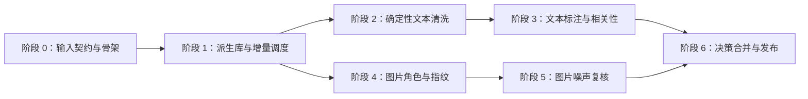

# tourism-ugc-study 数据清洗工程方案

> 方案版本：`2.4`
> 同步日期：`2026-07-29`
> 配套科研文档：[data-cleaning-research.html](../methods/data-cleaning-research.html)

## 1. 文档职责

本文只回答“如何实现、运行、验证和回滚”。研究对象边界、标签定义、抽样理由、人工一致性、论文表述和学术引用以配套科研文档为准。

本方案是待实现的工程规格。当前 `scripts/build_research_dataset.py` 只覆盖既有字段规范化和部分派生逻辑，尚未完整实现本文规定的旅游相关性分类、图片指纹、图片噪声决策、新版标注导入与运行级决策表。

当前实施状态集中如下，避免把目标接口误认为现有能力：

| 能力 | 状态 | 说明 |
| --- | --- | --- |
| 正式采集库与只读审计 | 已具备 | 可查询 `web_posts`、`web_post_images`；不得回写 |
| 既有派生构建脚本 | 部分具备 | 只覆盖部分规范化和派生字段，不等同于本方案 |
| 派生清洗库与增量调度 | 待实现，第一建设阶段 | 应先完成，以支持“抓一批、洗一批”和断点恢复 |
| 文本规范化、重复与相关性 | 待实现 | 在派生库和调度层稳定后分阶段接入 |
| 图片角色、文件指纹与噪声决策 | 待实现且部分阻塞 | 角色可先处理；文件指纹依赖受控本地图片 manifest |
| 最终分析视图与质量报告 | 待实现 | 必须建立在前述阶段的版本化结果之上 |

## 2. 两份文档的同步契约

以下字段在工程文档与科研文档中必须保持一致，并在同一个 commit/PR 中更新：

| 同步项 | 当前值 |
| --- | --- |
| 清洗方案版本 | `2.4` |
| 文本标签手册 | `text-relevance-v1.0` |
| 图片标签手册 | `image-noise-v1.0` |
| 随机种子 | `20260728` |
| 输入前提 | 上游交付的数据集已只含青岛；清洗仅验证前提，不筛选城市、不生成范围标签 |
| 当前数据库状态 | 上游 schema 已移除城市字段并以迁移 13 证明青岛范围定稿；最终记录数由每次快照动态统计 |
| 当前图片关系 | 数量由每次快照按 `content`、`author_avatar`、`page` 动态统计，不写死阶段值 |
| 文本初始人工量 | 500 条概率样本＋200 条定向样本；200 条双标 |
| 图片初始人工量 | 600 张概率样本＋规则/重复簇代表项；200 张双标 |
| 文本分类器 | 字符 2–5 gram TF-IDF＋`LinearSVC` |
| 图片近同方法 | 文件 SHA-256＋64 位 DCT pHash＋人工簇审阅 |
| 决策状态 | `keep`、`review`、`exclude`、`evidence_only` |
| 原始数据策略 | 源 SQLite 只读；不物理删除 |

同步规则：

1. 研究口径改变时，先修改科研文档，再在同一提交更新工程配置、schema 和验收条件。
2. 实现约束导致方法变化时，必须回到科研文档说明影响，不能只改代码。
3. 只修改文字说明、且不影响上表项目时，可单独更新对应文档。
4. 两份文档的版本号不一致时，不得执行正式清洗运行。

## 3. 权威输入与禁止项

### 3.1 权威输入

- 项目：`/Users/kawauso/Documents/Projects/TripPostCollect`
- 正式库：`/Users/kawauso/Documents/Projects/TripPostCollect/data/trippostcollect.sqlite`
- 帖子表：`web_posts`
- 图片关系表：`web_post_images`
- 图片主键：`web_post_images.id`
- 帖子主键：`web_posts.id`

### 3.2 禁止项

- 不使用 `data/trip_posts.sqlite3`、`data/trip_posts.db` 或 `data/trippostcollect.db` 等 0 字节文件。
- 不回写正式库，不物理删除源帖子或图片关系。
- 不在清洗运行中抓取、登录或重新访问平台。
- 不把原始 UGC、作者直接标识和图片字节提交到 Git。
- 不调用 LLM、云端分类 API、深度视觉模型或多模态模型。

### 3.3 当前数据库审视与实现影响

下表记录当前上游 schema 的稳定契约。帖子、平台和图片数量随采集继续增长，正式运行必须从冻结快照重新生成，不得把阶段数字硬编码进规则。

| 只读观察 | 当前结果 | 工程处理 |
| --- | --- | --- |
| 城市范围 schema | `web_posts` 不含 `city_name`；`schema_migrations` 的 13 / `remove_city_name` 表明上游已删除范围外记录后移除城市列 | 清洗读取该迁移作为上游范围声明；若旧版夹具仍含 `city_name`，只做整库断言，不生成逐条标签 |
| 输入数量 | 帖子、平台、检索词、时间和图片数量均未冻结 | manifest 从当前快照动态统计；最终数据量是容量规划中的唯一变量 |
| 平台字段形态 | 标题等字段允许存在平台结构差异 | 可用性规则必须分平台；无标题但正文有效不触发 `invalid` |
| 图片关系角色 | `web_post_images.image_role` 固定为 `content`、`author_avatar`、`page` | 头像离开内容图视图，页面图只作证据；各角色数量由快照报告 |
| 图片文件信息 | 文件级处理依赖上游另行提供的受控本地 manifest | manifest 不可用时图片文件阶段标记为 `blocked_by_manifest`，不能伪造结果或在线补抓 |
| URL 与文本重复候选 | 重复规模必须从正式快照重新计算 | URL 复用和文本相同只生成簇；源关系不删除，近重复另行评估 |

此前 LLM 对少量标题、正文和图片关系做过探索性浏览，提示关键词召回中可能混入非旅游主旨内容，且图片关系可能包含头像或页面技术资产。这些观察只用于确定待检规则和抽样方向，不写入 `post_annotations` 或 `image_annotations`，也不作为污染率、模型标签或最终排除依据。

**职责边界：**本工程不执行城市筛选。当前 schema 通过上游迁移 13 声明青岛范围；兼容旧 schema 时，若 `city_name` 检查发现非青岛或城市缺失记录，运行以 `input_rejected` 结束并返回上游处理。无城市列且缺少该迁移声明的输入同样拒绝，任何路径都不生成逐条城市清洗决策。

## 4. 推荐技术栈：复用成熟组件

无需自行实现 TF-IDF、SVM、分组交叉验证、图像解码、哈希或标注平台。

| 任务 | 推荐组件 | 本项目只需实现的部分 |
| --- | --- | --- |
| 稀疏文本特征与分类 | `scikit-learn`：`TfidfVectorizer`、`LinearSVC`、`StratifiedGroupKFold` | 数据适配、泄漏组、阈值和报告 |
| 图片解码与元数据 | Pillow | EXIF 方向统一、失败状态和 manifest |
| 感知哈希 | `ImageHash`：`imagehash.phash` | 阈值校准、候选建簇和人工确认 |
| 精确哈希 | Python `hashlib.sha256` | 流式读取、清单与一致性检查 |
| 数据与决策存储 | Python `sqlite3`＋SQLite views | schema、迁移、幂等写入和审计视图 |
| 一致性快照 | Python `sqlite3.Connection.backup` | 路径、锁、哈希和运行 manifest |
| 人工标注 | 单独的本地 Label Studio 容器，或仓库现有 CSV 模板 | 标签配置、任务导入、盲标和结果导入 |
| 测试 | `pytest` | 固定夹具、回归计数、无泄漏和只读测试 |

正式 Python 依赖固定到项目 `.venv` 和锁文件，不使用全局 Python 环境。若采用 Label Studio，使用固定版本或镜像摘要的本地容器，与项目 Python 环境和公网隔离；不使用 `latest` 标签执行正式标注。

## 5. 目标目录与模块边界

```text
configs/
├── cleaning-v2.4.yaml          # 清洗规则、阈值、种子、批次和角色映射
├── cleaning-text-normalization-v1.yaml  # 文本规范化与替换规则
└── cleaning-image-noise-v1.yaml         # URL 词表、尺寸与复用候选阈值

src/tourism_ugc_study/cleaning/
├── snapshot.py                 # 一致性快照与哈希
├── inventory.py                # 源对象登记、逐对象指纹和版本变化发现
├── scheduler.py                # 批次冻结、阶段依赖、领取和恢复
├── state_machine.py            # run/batch/task 状态转换与约束
├── text_normalize.py           # 文本规范化
├── text_duplicates.py          # 精确/近重复候选
├── image_fingerprint.py        # 文件元数据、SHA-256、pHash
├── image_candidates.py         # 技术噪声候选和聚类
├── decisions.py                # 人工优先的决策合并
└── schema.py                   # 派生 SQLite schema 与 views

src/tourism_ugc_study/annotation/
├── sampling.py                 # 概率样本与定向样本
├── import_labels.py            # Label Studio/CSV 导入
├── agreement.py                # 一致率、Cohen's κ、仲裁
└── leakage_groups.py           # 作者＋重复簇连通分量

src/tourism_ugc_study/models/text/
├── relevance.py                # TF-IDF＋LinearSVC pipeline
├── split.py                    # 分组与时间切分
└── thresholds.py               # margin 分流和审计抽样

scripts/
├── cleaning_snapshot_source.py
├── cleaning_discover_increment.py
├── cleaning_create_batch.py
├── cleaning_run_batch.py
├── cleaning_resume_batch.py
├── cleaning_build_candidates.py
├── cleaning_build_image_fingerprints.py
├── cleaning_finalize_decisions.py
├── cleaning_build_analysis_views.py
├── annotation_export_tasks.py
├── annotation_import_annotations.py
├── annotation_adjudicate.py
└── text_train_relevance.py
```

脚本只解析参数和调用核心模块，不承载业务规则。

## 6. 配置文件必须显式保存的参数

```yaml
protocol_version: "2.4"
text_label_guide_version: "text-relevance-v1.0"
image_label_guide_version: "image-noise-v1.0"
random_seed: 20260728

incremental:
  max_posts_per_batch: 1000
  claim_size: 50
  max_attempts: 3
  stale_after_minutes: 60
  post_order: [captured_at, id]
  changed_source_action: reprocess_impacted_stages

text:
  analyzer: char
  ngram_range: [2, 5]
  min_df: 2
  max_df: 0.995
  sublinear_tf: true
  class_weight: balanced
  c_grid: [0.1, 1.0, 10.0]
  temporal_test_fraction: 0.20

image:
  phash_hash_size: 8
  phash_highfreq_factor: 4
  candidate_hamming_max: 10
  tiny_side_px: 64
  tiny_file_bytes: 2048
  extreme_aspect_ratio: 8.0
  repeated_post_min: 10
  repeated_author_min: 3
```

批次大小和领取数只是工程默认值，不改变科研抽样量；正式运行前可根据机器内存调整并另存配置版本。上述图片阈值只产生候选。正式 pHash 判定阈值由 300 对人工标注图片对校准后写入新的配置版本，不能原地覆盖。

## 7. 工程流水线

### 7.1 冻结输入

1. 接收上游已经完成城市范围定稿的正式数据库或 manifest；这是清洗入口前提，不是清洗产物。
2. 以 SQLite URI `mode=ro` 打开正式库并记录源文件与 WAL 哈希；该连接不执行任何写入或 schema 初始化。
3. 使用 SQLite backup API 创建一致性临时快照；后续输入契约、计数和对象清单只从该快照读取。
4. 在快照上验证必需表/列、完整性、外键和城市范围契约：当前 schema 必须存在迁移 13 / `remove_city_name`；兼容旧 schema 时，`city_name` 必须非空且仅为 `青岛` / `青岛市`。缺少可验证声明、存在范围外值或城市缺失时写入运行级 `input_rejected` 并停止；不得筛选记录或生成逐条范围标签。
5. 在本地派生库记录完整源路径；去标识化 manifest 只记录逻辑文件名、路径身份哈希、源库与快照 SHA-256、文件大小、表行数、对象清单哈希、输入契约结果和 UTC/Asia-Shanghai 时间。
6. 再次验证正式库文件与 WAL 哈希不变；运行期间只访问快照，不继续读取变化中的正式库。

### 7.2 帖子处理

1. 读取 `web_posts`，保留源 ID。
2. 执行 NFKC、不可见字符和空白规范化，生成规范化文本 SHA-256。
3. 生成结构无效候选、字段异常和文本精确重复簇。
4. 用字符 3–5 gram 相似度生成近重复候选；人工确认后冻结簇。
5. 从正式输入导出 500 条概率样本和 200 条定向样本，两个抽样框分开保存。
6. 导入原始标注和仲裁标签，生成泄漏组。
7. 在无泄漏切分上训练文本相关性模型，保存 margin 和阈值动作。
8. 合并硬规则、人工标签与模型建议。人工标签优先级最高。

### 7.3 图片处理

1. 对正式输入中的图片按 `image_role` 分流：头像 `exclude`，页面图 `evidence_only`，内容图进入检查；本步骤不进行城市筛选。
2. 从本地图片 manifest 定位文件；缺失和解码失败分别记录，不尝试在线补取。
3. 统一 EXIF 方向后计算尺寸、MIME、字节数、文件 SHA-256 和 64 位 pHash。
4. 根据 URL 词表、尺寸、长宽比、透明度和跨帖复用产生高召回候选。
5. 文件 SHA-256 完全相同者成精确簇；pHash 汉明距离仅产生近同候选。
6. 导出 600 张概率样本、规则簇代表项和 300 对 pHash 校准图片对。
7. 导入人工标签；精确簇可传播已确认标签，感知近同簇按抽查规则传播。

### 7.4 构建分析视图

- `analysis_posts_eligible`
- `analysis_posts_deduplicated`
- `analysis_images_eligible`
- `analysis_images_evidence_only`

`analysis_posts_eligible` 必须显式过滤 `cleaning_decision='keep'`；`analysis_images_eligible` 只能关联这些帖子。城市范围已由运行级输入契约确认，此处只断言对应快照的契约状态为 `accepted`，绝不按城市过滤行。所有视图必须通过明确的 `run_id` 构建，禁止依赖“最新一行”或隐式时间排序。

## 8. 派生 SQLite 设计

推荐位置：`data/processed/cleaning.sqlite`，文件由 `.gitignore` 排除，只提交 schema、迁移和去标识化 manifest。

### 8.1 数据库职责

- `TripPostCollect/data/trippostcollect.sqlite` 继续承担原始采集证据与业务字段存储，只读。
- `tourism-ugc-study/data/processed/cleaning.sqlite` 承担源对象登记、批次调度、阶段进度、人工标注、模型结果、最终决策和分析视图。
- 两库不建立可写级联关系；使用源库身份、源对象 ID、对象输入指纹和源快照 SHA-256 联合关联。
- “已清洗/未清洗”不是写回 `web_posts` 的布尔字段，而是由派生库中各阶段任务状态计算出的视图。

### 8.2 推荐表

| 表 | 最小内容 |
| --- | --- |
| `source_snapshots` | `snapshot_id`、源库身份与 SHA-256、帖子/图片行数、输入契约结果、创建时间 |
| `source_post_inventory` | 源帖子 ID、平台与平台帖子 ID、首次/最近发现快照、当前结构/文本阶段指纹、当前源版本号 |
| `source_image_inventory` | 源图片关系 ID、源帖子 ID、首次/最近发现快照、当前关系/文件阶段指纹、当前源版本号 |
| `source_post_versions` | 源帖子 ID、源版本号、各阶段输入指纹、生效快照；只保存指纹和最小派生元数据，不复制原始正文 |
| `source_image_versions` | 源图片关系 ID、源版本号、各阶段输入指纹、生效快照；不复制图片字节 |
| `cleaning_runs` | `run_id`、`full/incremental/reprocess` 类型、输入快照、协议/代码/环境版本、种子、开始/结束时间、运行状态 |
| `cleaning_batches` | `batch_id`、运行 ID、冻结对象清单哈希、帖子/图片数量、创建顺序、批次状态 |
| `stage_tasks` | 批次、对象类型与 ID、源版本、阶段、算法/手册版本、状态、尝试次数、开始/结束时间、错误代码 |
| `stage_events` | 每次状态转换的追加式事件日志，含旧状态、新状态、操作者/进程、时间和理由 |
| `post_annotations` | 帖子 ID、抽样框、标注者哈希、各判断轴、理由、标注时间 |
| `post_decisions` | 可用性、相关性、推广、`cleaning_decision`、理由、人工状态 |
| `text_duplicate_members` | 簇、成员、类型、相似度、代表项 |
| `text_model_runs` | 特征、超参数、切分哈希、评估指标、模型文件哈希 |
| `text_model_predictions` | 帖子 ID、margin、分流动作、模型运行 ID |
| `image_fingerprints` | 图片 ID、URL/文件 SHA-256、pHash、尺寸、MIME、状态、提取器版本 |
| `image_duplicate_members` | 簇、成员、SHA/pHash 类型、距离、代表项 |
| `image_annotations` | 图片 ID、主标签、属性、标注者哈希、理由、时间 |
| `image_decisions` | 图片 ID、最终状态、理由、人工状态和传播来源 |

### 8.3 三类状态不得混用

| 层级 | 状态 | 含义 |
| --- | --- | --- |
| `cleaning_runs.status` | `planned`、`running`、`paused`、`accepted`、`failed`、`aborted`、`input_rejected` | 一次完整或增量运行的生命周期 |
| `cleaning_batches.status` | `pending`、`running`、`completed`、`completed_with_blocks`、`failed` | 一个冻结批次的汇总进度 |
| `stage_tasks.status` | `pending`、`running`、`succeeded`、`failed`、`blocked`、`skipped` | 某个源对象在某一处理阶段的执行状态 |
| `cleaning_decision` | `keep`、`review`、`exclude`、`evidence_only` | 科研意义上的最终清洗决策，不代表程序是否成功运行 |

建立 `v_post_cleaning_progress` 和 `v_image_cleaning_progress`，向人类成员提供简化状态：

- `pending`：至少一个必需阶段尚未执行；
- `processing`：存在正在执行的阶段；
- `needs_review`：自动阶段完成，但等待人工标注或仲裁；
- `completed`：当前源版本和协议版本所需阶段全部成功，并已形成最终决策；
- `blocked`：缺少图片 manifest、人工标签或其他明确前置材料；
- `failed`：阶段达到最大尝试次数仍失败；
- `needs_reprocessing`：源对象指纹、规则、手册或算法版本变化，旧结果仍保留但不能代表当前版本。

因此，“已清洗”必须解释为“针对指定源版本和清洗协议版本已完成”，不能跨版本永久有效。

### 8.4 关键约束

约束：

- `stage_tasks` 以 `(run_id, batch_id, stage_name, object_type, source_object_id, source_version)` 建唯一索引，重复执行不得制造第二份任务。
- 输入指纹按阶段分别计算，避免一处无关变化导致全链重跑：文本指纹覆盖平台、标题、正文及文本规则所需字段；作者分组指纹覆盖作者标识；图片关系指纹覆盖角色、URL 和索引；文件指纹覆盖本地 manifest 标识。互动量变化不应触发文本或图片重洗。
- 同一源 ID 的输入指纹变化时新增源版本和新任务，不覆盖旧版本结果。
- 协议、标签手册、算法或阈值变化时，只为受影响阶段及其下游创建新任务；旧任务和旧决策保留。
- `reason_code` 使用枚举表或 CHECK 约束，禁止自由文本充当机器状态。
- 状态转换必须经过 `state_machine.py`；例如 `succeeded` 不得直接回到 `running`，重跑应创建新尝试或新任务版本。
- 人工原始标签不可更新，只能追加；仲裁另写记录。
- `model_predictions` 不得覆盖 `post_decisions`。
- 跨库关联同时检查源快照 SHA-256，不能只信任整数 ID。

数据库启用外键、WAL 和 `busy_timeout`；调度器保持 SQLite 单写者，任务计算可并行，但状态提交集中串行完成。

## 9. 增量发现、批次调度与恢复

### 9.1 如何识别“新抓到的数据”

每次增量运行都先对正式采集库创建只读一致性快照，再执行以下比较：

1. 扫描快照中的帖子和图片关系，计算各自的清洗输入指纹。
2. 源 ID 未出现在 inventory：登记为新对象，建立源版本 1，并为第一个必需阶段创建 `pending` 任务。
3. 源 ID 已存在且输入指纹不变：更新 `last_seen_snapshot_id`，不重复清洗。
4. 源 ID 已存在但输入指纹变化：新增源版本，根据字段影响矩阵创建受影响阶段及下游任务，进度视图显示 `needs_reprocessing`。
5. 对象未出现在新快照：只记录最近一次发现位置，不删除 inventory、标签或历史结果；是否属于源端删除另行审计。

不能只依赖 `MAX(id)` 或 `captured_at` 发现增量，因为旧记录可能被补写或修正。ID/时间可用于排序，是否需要处理由“源 ID＋清洗输入指纹＋阶段版本”决定。

字段变化的默认影响范围：

| 变化 | 需要重跑 | 不需要重跑 |
| --- | --- | --- |
| 标题、正文或文本规范化所需字段 | `text_deterministic`、`text_relevance`、`finalize` | 已完成的图片文件指纹 |
| 作者平台 ID | 泄漏组、模型切分/评估及 `finalize` | 文本规范化、图片文件指纹 |
| 图片角色、URL 或关系索引 | `image_role` 及其下游 | 已完成的文本规范化 |
| 本地文件 manifest 或文件字节变化 | `image_fingerprint`、`image_noise`、`finalize` | 文本阶段 |
| 点赞、收藏、评论等互动指标 | 默认不触发清洗重跑，只更新分析侧数据版本 | 全部清洗阶段 |
| 规则、手册、算法或阈值版本变化 | 对应阶段及其下游 | 无依赖的并行阶段 |

### 9.2 如何冻结一批

1. 调度器从 `pending` 任务中按 `captured_at, id` 稳定排序，默认最多选择 1,000 条帖子及其关联图片。
2. 将源对象 ID、源版本和阶段版本写入 `cleaning_batches` 的不可变清单，并保存清单 SHA-256。
3. 批次创建后不再从变化中的正式库追加对象；新抓记录进入下一批。
4. 同一批可分阶段完成，文本已完成不必等待图片 manifest；分别生成文本就绪和图片就绪进度。
5. 科研概率抽样是独立任务，不由工程批次大小替代。1,000 条一批只是运行与恢复单位。

### 9.3 阶段依赖

| 阶段代码 | 处理对象 | 依赖 | 主要输出 |
| --- | --- | --- | --- |
| `inventory` | 帖子、图片关系 | 合格源快照 | inventory、源版本和输入指纹 |
| `text_deterministic` | 帖子 | `inventory` | 规范化文本、结构候选、精确/近重复候选 |
| `text_relevance` | 帖子 | `text_deterministic`、可用标注/模型版本 | 相关性人工状态、模型建议和帖子决策候选 |
| `image_role` | 图片关系 | `inventory` | 头像、页面证据和内容图分流 |
| `image_fingerprint` | 内容图 | `image_role`、本地图片 manifest | 解码状态、尺寸、SHA-256、pHash 和重复簇 |
| `image_noise` | 内容图 | `image_fingerprint`、可用人工标签 | 图片技术噪声决策候选 |
| `finalize` | 帖子、图片 | 所需文本/图片阶段完成 | 最终决策、分析视图和质量报告 |

缺少人工标签时，任务进入 `needs_review` 派生进度；缺少本地图片 manifest 时，图片指纹任务为 `blocked`。二者都不应伪装为 `failed` 或 `completed`。

### 9.4 领取、检查点和失败恢复

- `cleaning_run_batch.py` 每次在短事务中领取最多 `claim_size` 个任务，将其从 `pending` 改为 `running`，随后在事务外计算，避免长时间锁库。
- 每个任务完成后立即写结果、输出哈希和 `stage_events`，再置为 `succeeded`；不等整批结束才一次性落库。
- 进程意外退出后，超过 `stale_after_minutes` 的 `running` 任务标为可恢复故障。只有显式执行 `cleaning_resume_batch.py` 才增加 `attempt_count` 并重新排队，不静默重试。
- 达到 `max_attempts` 后置为 `failed`，保留异常类型和短错误摘要；不得把正文、作者信息或令牌写入错误日志。
- 人工修复 manifest、配置或标注后，通过新的恢复事件继续相同批次；若算法或协议改变，则创建新运行，不篡改旧批次。

### 9.5 批次验收与“洗完一批”定义

一个批次只有同时满足以下条件，才可标为 `completed`：

- 不存在 `pending`、`running`、`failed` 或 `blocked` 的必需任务；
- 允许跳过的任务均具有明确 `skipped` 理由；
- 当前源版本、协议版本、对象清单哈希和输出哈希齐全；
- 人工复核要求已经满足，最终决策不存在无理由空值；
- 分阶段计数守恒，且源数据库运行前后哈希不变。

若文本已完成但图片因 manifest 阻塞，批次可标为 `completed_with_blocks`，但只能发布 `text_ready` 视图，不能宣称整个对象已清洗完成。最终论文使用的分析视图只能来自 `accepted` 运行。

## 10. 命令行入口

源快照、增量发现、批次冻结、任务领取/检查点、状态查询和显式恢复已经实现；候选生成、模型、最终决策和分析视图仍是后续接口：

```bash
.venv/bin/python scripts/cleaning_snapshot_source.py --derived-db <DB> --config <CONFIG> --source-db <SOURCE> --run-id <RUN_ID>
.venv/bin/python scripts/cleaning_discover_increment.py --derived-db <DB> --config <CONFIG> --snapshot-id <SNAPSHOT_ID>
.venv/bin/python scripts/cleaning_create_batch.py --derived-db <DB> --config <CONFIG> --run-id <RUN_ID> --max-posts 1000
.venv/bin/python scripts/cleaning_run_batch.py --derived-db <DB> --config <CONFIG> --batch-id <BATCH_ID> --stage text_deterministic
.venv/bin/python scripts/cleaning_resume_batch.py --derived-db <DB> --config <CONFIG> --batch-id <BATCH_ID> --failed-only
.venv/bin/python scripts/cleaning_build_candidates.py --run-id <RUN_ID>
.venv/bin/python scripts/cleaning_build_image_fingerprints.py --run-id <RUN_ID>
.venv/bin/python scripts/annotation_export_tasks.py --run-id <RUN_ID>
.venv/bin/python scripts/annotation_import_annotations.py --run-id <RUN_ID>
.venv/bin/python scripts/text_train_relevance.py --run-id <RUN_ID>
.venv/bin/python scripts/cleaning_finalize_decisions.py --run-id <RUN_ID>
.venv/bin/python scripts/cleaning_build_analysis_views.py --run-id <RUN_ID>
.venv/bin/python scripts/cleaning_run_batch.py --derived-db <DB> --config <CONFIG> --batch-id <BATCH_ID> --status
.venv/bin/python -m pytest -q
```

`cleaning_run_batch.py --stage` 在短事务中领取就绪任务并返回去内容化任务身份；它不执行尚未实现的文本或图片算法，也不会把领取等同于成功。处理器计算完成后，用 `--finish-task <TASK_ID> --result <RESULT>` 逐任务提交检查点；异常详情仅保存 SHA-256 摘要。当前实现因此可以验证增量调度和断点恢复，但不能宣称已经产生科研清洗决策。

## 11. 测试与验收

### 11.1 单元测试

- 输入契约接受带迁移 13 声明的当前 schema，以及 `city_name` 仅含青岛值的旧 schema 夹具；旧 schema 遇到范围外值/城市缺失，或当前 schema 缺少迁移声明时，整次运行返回 `input_rejected`，且不生成逐条城市清洗决策。
- 新源 ID 创建 `pending` 任务；相同 ID 和相同输入指纹不重复建任务；指纹变化只重建受影响阶段及下游任务。
- 同一批次和源版本的任务具有唯一性；非法状态转换应失败并留下事件记录。
- 批次冻结后新加入源快照的记录不得混入该批；稳定排序和固定配置产生相同对象清单哈希。
- Unicode、不可见字符、换行和 URL 规范化金样本。
- 空作者不得被哈希成同一个泄漏组。
- SHA-256 精确簇、pHash 距离和 EXIF 方向固定夹具。
- 角色分流、理由代码和决策优先级。
- 同一配置与种子产生相同抽样 ID。

### 11.2 集成测试

- 源库通过 URI `mode=ro` 打开，写操作应失败。
- 从脱敏夹具构建完整派生库和四个清洗分析视图。
- 连续导入两个源快照，验证只调度新增或输入指纹变化的记录；源端消失记录不得导致历史结果被删除。
- 模拟任务中断，验证批次保留已成功检查点；显式恢复只重跑失败/过期任务，成功任务不重复计算。
- 缺少图片 manifest 时文本阶段可完成，图片阶段为 `blocked`，整体不得误报为完全清洗完成。
- 训练集拟合向量器，验证/测试文本不得提前进入词表。
- 同一作者与同一重复簇不得跨训练、验证或测试分区。
- 人工确认可覆盖模型建议，模型不能覆盖人工标签。

### 11.3 回归与验收

- 相同输入、代码和配置重跑后，状态计数、簇成员和输出哈希一致。
- 代码版本同时记录 Git SHA 与脏工作树摘要；存在未提交改动的运行不得与干净提交共享同一版本标识。
- `v_post_cleaning_progress` 与 `stage_tasks` 可追溯对应；任何 `completed` 对象都具有当前源版本和协议版本的全部必需成功任务。
- 质量报告列出正式青岛输入、各项清洗决策和最终分析数量；不出现按城市筛选或范围外清洗计数。
- 输入契约确认当前 schema 的迁移 13 / `remove_city_name` 声明，或兼容旧 schema 的青岛唯一性检查；契约不为 `accepted` 时没有任何合格视图产出。
- 文本建议排除项 100% 具备人工确认和理由代码。
- 感知近同簇的标签传播具有抽查证据。
- 运行前后正式库 SHA-256 不变。
- 质量报告按平台列出输入、保留、复核、排除和原因。
- 科研文档要求的 κ、人工审计和分平台模型指标均已生成，否则运行不能标为 `accepted`。

## 12. 分阶段实施路线与复杂度

每一阶段都应形成可运行、可测试、可回滚的独立交付，不把全部功能堆到一次大提交中。



| 建设阶段 | 范围与主要交付 | 阶段完成条件 | 预估工作量 |
| --- | --- | --- | ---: |
| 0. 输入契约与骨架 | 固定只读源库接口、配置加载、日志脱敏、迁移框架和脱敏测试夹具 | 当前 schema 范围声明可验证；旧 schema 混合城市与无声明输入能安全拒绝；源库写入测试必然失败 | 1–2 人日 |
| 1. 派生数据库与增量调度 | 本章第 8–9 节 schema、inventory、源版本、批次、任务状态机、发现增量、断点恢复和进度视图 | 可对两个连续快照稳定识别新增/变化记录；可创建、暂停、恢复批次；尚不要求执行真正文本或图片清洗 | 3–5 人日 |
| 2. 确定性文本清洗 | 文本规范化、结构可用性规则、精确重复和近重复候选，接入 `text_deterministic` | 同一批次重跑哈希一致；微博空标题等平台规则通过测试；可以持续输出文本候选 | 2–3 人日 |
| 3. 文本人工标注与相关性 | 抽样导出、标签导入、双标/仲裁、泄漏组、TF-IDF＋SVM、阈值分流，接入 `text_relevance` | 人工覆盖优先级、无泄漏切分和科研文档的 κ/审计指标通过验收 | 3–5 人日＋人工标注时间 |
| 4. 图片角色与文件指纹 | `image_role` 分流、本地 manifest、解码元数据、SHA-256、pHash 和重复候选 | 头像/页面证据确定性分流可用；缺文件为 `blocked`；固定夹具哈希稳定 | 3–5 人日 |
| 5. 图片噪声复核 | 图片概率抽样、规则簇/近同簇导出、人工标签导入、有限标签传播和审计 | 传播均有人工证据；技术噪声审计达到科研方案控制线 | 2–4 人日＋人工标注时间 |
| 6. 决策合并与正式发布 | 帖子/图片最终决策、文本/图片就绪视图、去重视图、质量报告、运行验收和回滚 | 只有 `accepted` 运行可供论文分析；计数、哈希、版本和理由链完整 | 2–4 人日 |

建议先只实现阶段 0–1。完成后，即使文本和图片算法尚未接入，也已经能够可靠回答“哪些新数据待处理、哪一批进行到哪里、失败后从哪里恢复”。阶段 2 完成后可开始按批执行确定性文本处理；阶段 3 后才形成旅游相关性决策；阶段 4–5 完成后才形成图片清洗决策；阶段 6 负责正式发布，不反向修改前面的历史记录。

一名熟悉 Python、SQLite 和 scikit-learn 的工程成员，完整稳健实现预计约 16–28 人日，另加人工标注时间；阶段 0–1 的第一可用里程碑约 4–7 人日。计算成本较低，主要风险是状态、版本、人工标签和源对象变化的可追溯性。

## 13. 回滚

- 单个任务失败：保留成功检查点，修复前置条件后显式执行 `cleaning_resume_batch.py`；不重跑已成功任务。
- 某一批次不可接受：将批次标为 `failed/aborted`，不发布视图；源对象可在新批次重新调度。
- 新规则、标签手册、依赖或阈值：创建新的 `run_id`、配置版本及受影响阶段任务，不覆盖旧决策。
- schema 迁移：迁移前备份 `cleaning.sqlite` 并记录 SHA-256；迁移失败切回备份和上一 schema 版本，不触碰正式采集库。
- 论文和分析脚本显式声明已验收 `run_id`；逻辑回滚只需切换到上一 `accepted` 运行。

## 14. 成熟组件链接

- [scikit-learn TfidfVectorizer](https://scikit-learn.org/stable/modules/generated/sklearn.feature_extraction.text.TfidfVectorizer.html)
- [scikit-learn LinearSVC](https://scikit-learn.org/stable/modules/generated/sklearn.svm.LinearSVC.html)
- [scikit-learn StratifiedGroupKFold](https://scikit-learn.org/stable/modules/generated/sklearn.model_selection.StratifiedGroupKFold.html)
- [ImageHash](https://github.com/JohannesBuchner/imagehash)
- [Label Studio 本地安装与标注流程](https://labelstud.io/guide/get_started)
- [SQLite Online Backup API](https://www.sqlite.org/backup.html)
