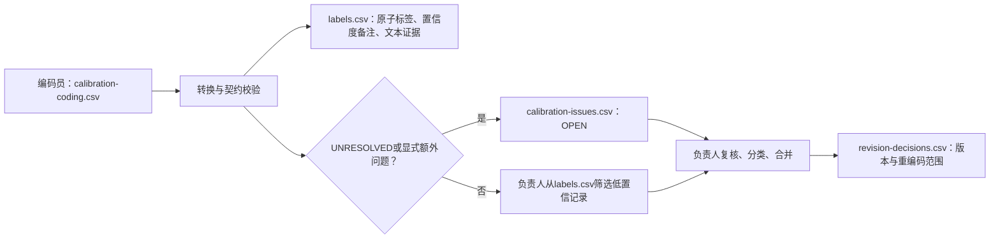

# 低置信度与文本证据表使用报告

> **文档状态**：`CURRENT_ALIGNED`
> **内部版本**：`v1.5`
> **用途**：指导共同校准、盲试标和正式人工标注中低置信度记录与文本证据的填写、转换、复核和审计。
>
> **规范状态**：操作说明；唯一上位标准为[`编码表.md`](../data-dictionary/编码表.md) v3.13.0。如本报告与上位标准冲突，以编码表为准。
>
> **适用范围**：文本轨的主观字段及其阳性判断；共同校准主表`calibration-coding.csv`、规范标签表`labels.csv`、问题表`calibration-issues.csv`和修订决策表`revision-decisions.csv`。
>
> **不适用范围**：客观导入字段、结构性`NA`、图像区域标注（其坐标契约尚未冻结）。

> **V0边界**：作者角色使用独立作者记录和证据manifest；其组件置信度、criterion codes与裁决契约以编码表v3.13.0为准，本报告不把文本证据表扩张为V0记录表。

## 一、结论摘要

低置信度记录和文本证据表服务于两类不同、但互相衔接的质量控制：

| 机制 | 要回答的问题 | 产出 | 不应用于 |
|---|---|---|---|
| 逐字段置信度 | 本次人工判断是否处在边界、冲突或证据不足的风险中？ | `confidence`与必要的`confidence_notes_json` | 准确率、效度、模型概率或研究结果 |
| 文本证据 | 哪段原文直接支持这项实质性阳性判断？ | `evidence_spans_json` | 为`0`、`UNK`、`NA`或整体排除判断虚构局部证据 |

二者均应逐字段保存：置信度用来安排风险复核，证据用来保证标签可回到原文审计。它们不能替代两名编码员的独立盲试标、信度计算或研究负责人的裁决。

## 二、使用时点与角色分工

### 2.1 阶段边界

| 阶段 | 低置信度如何使用 | 文本证据如何使用 | 结果地位 |
|---|---|---|---|
| 共同校准（约20—30篇） | 主观字段均评分；1—2级写备注并重点复核；1级使用`UNRESOLVED` | V3/V4/V5/V6实质性阳性判断摘录最短充分原文 | 用于发现规则缺口；不计算正式信度，也不产出研究结果 |
| 独立盲试标（约70—80篇新样本） | 继续逐字段评分，并用于分歧审计 | 继续定位阳性判断，便于核对分歧 | 首轮完成前不交换判断；`UNRESOLVED`必须在此阶段前关闭 |
| 正式标注、金标和训练池 | 对风险样本安排第二编码员复核；不把分数作为训练目标 | 保留可追溯证据，支持复核与错例分析 | 按冻结规则执行；规则改变须升版和确定重编码范围 |

### 2.2 分工

| 角色 | 必须做什么 | 不做什么 |
|---|---|---|
| 编码员 | 在主表填写编码值、主观字段置信度、触发时的简短备注及阳性证据原文 | 手写JSON、计算offset、编号问题、裁决或改变编码簿 |
| 转换工具 | 校验输入，生成`confidence_notes_json`、`evidence_spans_json`、Unicode offset和初步问题队列 | 决定类目、解释语义或批准规则修改 |
| 研究负责人 | 筛选全部低置信记录，分类/合并问题，形成修订与重编码决定 | 替代编码员作未记录的原子字段判断 |

## 三、低置信度记录：填写规则

### 3.1 五级量表

| 分值 | 判断锚点 | 作业动作 |
|---|---|---|
| 5 | 有直接、明确证据；与锚点高度一致；没有合理替代判断 | 正常保存 |
| 4 | 证据清楚；只需少量语境理解；替代判断明显不合理 | 正常保存 |
| 3 | 判断有依据，但接近边界、依赖语境，或有一个合理替代判断 | 正常保存；不强制备注 |
| 2 | 证据较弱、冲突或高度依赖上下文；存在两个以上合理判断 | 必填原因和一句说明；进入重点复核 |
| 1 | 没有足够证据支持唯一判断 | 共同校准期填`UNRESOLVED`；规则冻结后仅在字段正式允许时填`UNK`；必填原因和说明，并重点复核 |

置信度衡量的是**本次判断的可稳定性**，而不是帖文质量、编码员能力、标签重要性或“该标签为真的概率”。客观导入字段和结构性`NA`必须留空，不能填写置信度。

### 3.2 编码员填写的低置信度列

当`confidence <= 2`或`label_value = UNRESOLVED`时，必须在共同校准主表完成以下字段：

| 输入列 | 填写要求 | 示例 |
|---|---|---|
| `label_value` | 2级仍填现行规则下最可辩护的值；1级共同校准填`UNRESOLVED` | `1` / `UNRESOLVED` |
| `confidence` | 填`1`或`2`；`UNRESOLVED`必须是`1` | `2` |
| `reason_code` | 只选`BOUNDARY`、`CONTEXT`、`CONFLICT`、`EVIDENCE_MISSING`或`OTHER` | `CONTEXT` |
| `alternative_values` | 仅存在合理替代值时，用`|`分隔；没有则留空 | `0|1` |
| `low_confidence_note` | 一句说明证据或规则为什么不足；不写最终裁决 | `“舒服”可能是氛围渲染，也可能是明确评价。` |

分值3—5时，`reason_code`、`alternative_values`和`low_confidence_note`均必须留空。低置信度不自动等于问题登记：只有`UNRESOLVED`和编码员另行填写的框架/反例/语境/切分问题，才自动进入负责人问题队列；其余低置信记录保留在`labels.csv`中供筛选复核。

### 3.3 推荐复核顺序

1. 先筛选`confidence in {1, 2}`的所有记录，并按`field_name`、`reason_code`和编码员汇总。
2. 对同一字段反复出现的低置信模式，回看原文证据、完整帖文语境和现行锚点。
3. 对`UNRESOLVED`逐条处理：现行规则能裁决则形成明确规则；不能裁决则进入问题—决策—版本修订闭环。
4. 若低置信记录与编码分歧高度重合，优先修订定义、锚点或适用条件；若二者没有区分能力，重新校准置信度锚点，不能将置信度当成效度证据。

## 四、文本证据表：填写与生成规则

### 4.1 何时填写

文本轨中，V3、V4、V5和V6的**实质性阳性判断**原则上至少需要一段证据。`0`、`UNK`、`NA`及整体排除/不适用判断不填写伪造的局部证据；其理由由状态和低置信备注承载。

编码员在`calibration-coding.csv`只填写：

| 输入列 | 规则 |
|---|---|
| `evidence_quote` | 从不可变`raw_text`原样复制最短、足以支持判断的文字 |
| `evidence_start_if_repeated` | 仅当相同引文在`raw_text`中重复出现时，填该次出现的从0开始Unicode字符位置 |

选择证据时，否定、程度和转折若会影响含义，必须随证据一并纳入。例如“**不太**推荐”不能只摘“推荐”，“虽然拥挤，**但值得**”不能只摘“值得”。同一跨度可支持多个字段，父类和子类也可以共享同一最短充分证据；不连续证据应作为不同跨度保存。

### 4.2 规范文本证据表结构

转换后，`labels.csv`的`evidence_spans_json`保存如下数组。offset以不可变`raw_text`的Unicode字符计数，从0开始，采用左闭右开区间`[start, end)`：

```json
[
  {"fields":["at_has_eval"],"start":2,"end":5,"quote":"很舒服"}
]
```

必须始终满足：`raw_text[start:end] == quote`。转换工具会在下列情况拒绝导出：证据原文不在`raw_text`中、重复证据未给出起点、起点不是非负整数，或给出的起点与原文不匹配。

### 4.3 最小示例

假设`raw_text`为“海风很舒服，海风也很温柔。”，字段为`at_has_eval=1`。

| 主表输入 | 值 |
|---|---|
| `evidence_quote` | `很舒服` |
| `evidence_start_if_repeated` | 留空（该引文仅出现一次） |

转换后的证据为：

```json
[{"fields":["at_has_eval"],"start":2,"end":5,"quote":"很舒服"}]
```

若证据原文填写为“海风”，因它出现两次，必须填写具体起点，例如第二次出现的起点`6`；不能让工具猜测是哪一次。

## 五、从主表到规范表和问题闭环



共同校准完成后，可使用以下命令转换。当前脚本默认值已对齐v3.13.0；为使运行记录自说明，正式运行仍建议显式传入版本。

```bash
.venv/bin/python scripts/annotation_prepare_calibration.py \
  data/annotations/round_YYYYMMDD_purpose_vNN/calibration-coding.csv \
  --labels-output data/annotations/round_YYYYMMDD_purpose_vNN/labels.csv \
  --issues-output data/annotations/round_YYYYMMDD_purpose_vNN/calibration-issues.csv \
  --codebook-version v3.13.0
```

工具生成的结构化备注形如：

```json
{"reason_code":"BOUNDARY","alternative_values":[0,1],"note":"句子处于评价与氛围渲染边界。"}
```

`UNRESOLVED`会按原因代码进入初步问题类型：`BOUNDARY → BOUNDARY_CASE`、`CONTEXT → CONTEXT_DEPENDENCE`、`CONFLICT → COUNTEREXAMPLE`、`EVIDENCE_MISSING → CONTEXT_DEPENDENCE`、`OTHER → FRAMEWORK_GAP`。这只是工具的初步路由，研究负责人仍须确认分类。

## 六、负责人检查清单

- [ ] 每个主观且非`NA`的字段都有1—5置信度。
- [ ] 每条1—2级或`UNRESOLVED`记录都有合法原因代码和一句说明。
- [ ] `UNRESOLVED`均已进入问题队列，并在盲试标前关闭。
- [ ] 每个需要文本证据的实质性阳性判断都有最短充分引文；引文可在原始`raw_text`中精确定位。
- [ ] `labels.csv`中的`evidence_spans_json`满足`raw_text[start:end] == quote`，未混入帖子级或图像级记录。
- [ ] 其他低置信记录已从`labels.csv`完成筛选、复核并留存处理记录。
- [ ] 任何改变定义、值域、观察单位、纳入/排除边界或证据规则的决定，均已升版并在`revision-decisions.csv`写明`recoding_scope`。
- [ ] 轮次的`codebook_version`、轮次manifest和导出表版本完全一致。

## 七、常见误用与纠正

| 误用 | 为什么不对 | 正确做法 |
|---|---|---|
| 将置信度2理解为“标签有20%概率正确” | 该分数不是校准概率 | 把它用于优先复核和规则审计 |
| 给3级判断也填写原因备注 | 契约只允许低置信记录使用这些列，增加噪声 | 3级正常保存；仅在有额外框架问题时使用`other_issue_*` |
| 因为没有正向证据，就给`0`随便选一句话作证据 | `0`代表已完整判断后未观察到内容，不能伪造局部支持 | 保留空证据；必要时用低置信备注说明困难 |
| 用全文或长段落代替证据 | 无法精确说明何处支持字段，也提高复核负担 | 复制最短充分引文，并带上会改变含义的否定/程度/转折 |
| 在重复引文时不填起点 | 无法确定证据对应原文位置 | 只在重复时填写具体Unicode起点 |
| 将低置信记录自动当作新类别 | 风险记录不等于理论框架缺口 | 先按现行值域编码；确有缺口再登记问题并由负责人裁决 |
| 用共同校准的低置信率或一致率宣称正式信度 | 校准材料可用于改规则，不能作为独立检验 | 规则冻结后用新的独立样本盲试标并计算逐字段信度 |

## 八、可追溯性与发布边界

低置信度和文本证据仅用于审计、复核和编码簿开发；不得直接纳入H1—H8统计、作为BERT监督目标，或包装成主题分析结果。可提交或发布的标注表只使用匿名编码员ID，不应写入原文、作者ID、主页或图片URL；原文只在受控工作环境中通过任务身份读取。

本报告根据编码表v3.13.0、人工标注README、共同校准工作流决策和当前转换实现编制。解释性编码簿已对齐v3.13.0；人工宽表使用固定文件`data/annotations/templates/all-label-manual-coding.xlsx`，当前内部模板版本为`all-label-manual-coding-v2.5`。V4新增字段沿用相同的逐字段置信度和阳性证据规则；旧`rs_r_act`记录不得自动映射到新版字段。V0角色证据、组件置信度和裁决继续使用独立作者表，不得混入文本证据表。如任何操作说明与编码表冲突，仍以编码表为准。

## 九、内部迭代记录

| 内部版本 | 日期 | 变更 |
|---|---|---|
| v1.0 | 2026-08-21 | 建立低置信度、文本证据、转换与复核操作说明 |
| v1.1 | 2026-08-21 | 对齐编码表v3.9.0和固定Excel内部模板2.2，移除编码簿待更新警示 |
| v1.2 | 2026-08-21 | 同步固定Excel内部模板2.3新增的9个上级字段置信度项；低置信备注与证据使用边界不变 |
| v1.3 | 2026-08-21 | 对齐编码表v3.10.0和模板2.5；将V2新增活动/事件字段纳入逐字段置信度与证据契约，并禁止旧`rs_r_act`自动迁移 |
| v1.4 | 2026-08-22 | 对齐编码表v3.11.0连续编号；证据与置信度字段契约不变 |
| v1.5 | 2026-08-26 | 对齐编码表v3.13.0和当前转换默认值；明确V0作者角色继续使用独立记录，不扩张文本证据表职责 |
